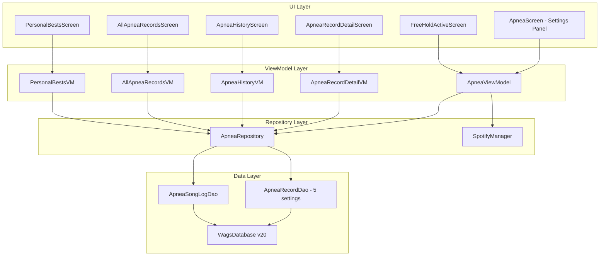

# Audio Setting + Spotify Integration Plan

**Created:** 2026-03-25T04:02:00Z (UTC-6:00)

## Overview

Add a 5th apnea setting type **Audio** with two options: `SILENCE` and `MUSIC`. When `MUSIC` is selected, integrate with Spotify to:
1. Send a play command when a hold/table starts (if not already playing)
2. Detect and record which song(s) played during the session via Android's MediaSession API
3. Store song metadata in a new `apnea_song_log` table linked to the apnea record

This is a cross-cutting upgrade touching **~25 files** across every layer of the app.

---

## Current Architecture (4 Settings)

```
Settings: timeOfDay (3) × lungVolume (3) × prepType (3) × posture (2) = 54 exact combos
Trophy levels: 1–5 (EXACT → GLOBAL)
DB version: 19
```

### Current Setting Dimensions
| Setting | Options | Stored as |
|---------|---------|-----------|
| `timeOfDay` | MORNING, DAY, NIGHT | String in `apnea_records.timeOfDay` |
| `lungVolume` | FULL, PARTIAL, EMPTY | String in `apnea_records.lungVolume` |
| `prepType` | NO_PREP, RESONANCE, HYPER | String in `apnea_records.prepType` |
| `posture` | SITTING, LAYING | String in `apnea_records.posture` |

## Target Architecture (5 Settings)

```
Settings: timeOfDay (3) × lungVolume (3) × prepType (3) × posture (2) × audio (2) = 108 exact combos
Trophy levels: 1–6 (EXACT → GLOBAL)
DB version: 20
```

### New Setting Dimension
| Setting | Options | Stored as |
|---------|---------|-----------|
| `audio` | SILENCE, MUSIC | String in `apnea_records.audio` |

---

## Combinatorial Impact on Trophy/PB System

With 5 settings, the PB hierarchy changes from 5 levels to 6 levels:

| Level | Constraints | Relaxed | Trophy Count | Combo Count |
|-------|------------|---------|-------------|-------------|
| EXACT | 5 | 0 | 1 🏆 | 108 |
| FOUR_SETTINGS | 4 | 1 | 2 🏆🏆 | C(5,4) groups = 5 groups |
| THREE_SETTINGS | 3 | 2 | 3 🏆🏆🏆 | C(5,3) groups = 10 groups |
| TWO_SETTINGS | 2 | 3 | 4 🏆🏆🏆🏆 | C(5,2) groups = 10 groups |
| ONE_SETTING | 1 | 4 | 5 🏆🏆🏆🏆🏆 | 5 groups |
| GLOBAL | 0 | 5 | 6 🏆🏆🏆🏆🏆🏆 | 1 |

### DAO Query Explosion

The current DAO has hand-written queries for every combination level:
- 4 single-setting queries
- 6 two-setting queries (C(4,2))
- 4 three-setting queries (C(4,3))
- 1 exact (4-setting) query
- 1 global query
- **Total: 16 query methods × 3 variants (getBest, isBest, wasBest) = 48 methods**

With 5 settings this becomes:
- 5 single-setting queries
- 10 two-setting queries (C(5,2))
- 10 three-setting queries (C(5,3))
- 5 four-setting queries (C(5,4))
- 1 exact (5-setting) query
- 1 global query
- **Total: 32 query methods × 3 variants = 96 methods**

**IMPORTANT DESIGN DECISION:** Rather than writing 96 hand-coded DAO methods, we should refactor to use a **dynamic query builder** approach with `@RawQuery` in Room. This will make the system maintainable and prevent the DAO from becoming unmanageable. The current 48-method approach was already at the limit.

---

## Phase-by-Phase Implementation Plan

### Phase 1: Domain Model Layer

**Files to create/modify:**

1. **NEW** [`AudioSetting.kt`](app/src/main/java/com/example/wags/domain/model/AudioSetting.kt)
   ```kotlin
   enum class AudioSetting {
       SILENCE, MUSIC;
       fun displayName(): String = when (this) {
           SILENCE -> "Silence"
           MUSIC   -> "Music"
       }
   }
   ```

2. **NEW** [`SpotifySong.kt`](app/src/main/java/com/example/wags/domain/model/SpotifySong.kt)
   ```kotlin
   data class SpotifySong(
       val title: String,
       val artist: String,
       val albumArt: String?,    // URL
       val spotifyUri: String?,  // spotify:track:xxx
       val startedAtMs: Long,    // epoch ms when song started during hold
       val endedAtMs: Long?      // epoch ms when song ended, null if still playing at hold end
   )
   ```

3. **MODIFY** [`PersonalBestCategory.kt`](app/src/main/java/com/example/wags/domain/model/PersonalBestCategory.kt:20)
   - Add `FOUR_SETTINGS` between `THREE_SETTINGS` and `EXACT`
   - Update `trophyCount()`: EXACT→1, FOUR_SETTINGS→2, THREE_SETTINGS→3, TWO_SETTINGS→4, ONE_SETTING→5, GLOBAL→6
   - Update all doc comments referencing "4 settings" → "5 settings"

---

### Phase 2: DB Migration v19→v20

**File to modify:** [`WagsDatabase.kt`](app/src/main/java/com/example/wags/data/db/WagsDatabase.kt:27)

```kotlin
val MIGRATION_19_20 = object : Migration(19, 20) {
    override fun migrate(db: SupportSQLiteDatabase) {
        // 1. Add audio column to apnea_records, default SILENCE for all existing records
        db.execSQL("ALTER TABLE apnea_records ADD COLUMN audio TEXT NOT NULL DEFAULT 'SILENCE'")
        
        // 2. Create song log table for Spotify track metadata
        db.execSQL("""
            CREATE TABLE IF NOT EXISTS apnea_song_log (
                songLogId   INTEGER PRIMARY KEY AUTOINCREMENT NOT NULL,
                recordId    INTEGER NOT NULL,
                title       TEXT NOT NULL,
                artist      TEXT NOT NULL,
                albumArt    TEXT,
                spotifyUri  TEXT,
                startedAtMs INTEGER NOT NULL,
                endedAtMs   INTEGER,
                FOREIGN KEY(recordId) REFERENCES apnea_records(recordId) ON DELETE CASCADE
            )
        """)
        db.execSQL("CREATE INDEX IF NOT EXISTS index_apnea_song_log_recordId ON apnea_song_log (recordId)")
    }
}
```

- Bump `version = 20` in `@Database` annotation
- Add `ApneaSongLogEntity::class` to entities list

**File to modify:** [`DatabaseModule.kt`](app/src/main/java/com/example/wags/di/DatabaseModule.kt:35)
- Add `WagsDatabase.MIGRATION_19_20` to the migration list

---

### Phase 3: DB Entity + DAO Updates

**Files to modify:**

1. **MODIFY** [`ApneaRecordEntity.kt`](app/src/main/java/com/example/wags/data/db/entity/ApneaRecordEntity.kt:8)
   - Add: `@ColumnInfo(defaultValue = "SILENCE") val audio: String = "SILENCE"`

2. **NEW** `ApneaSongLogEntity.kt`
   ```kotlin
   @Entity(tableName = "apnea_song_log",
           foreignKeys = [ForeignKey(entity = ApneaRecordEntity::class, ...)])
   data class ApneaSongLogEntity(
       @PrimaryKey(autoGenerate = true) val songLogId: Long = 0,
       val recordId: Long,
       val title: String,
       val artist: String,
       val albumArt: String?,
       val spotifyUri: String?,
       val startedAtMs: Long,
       val endedAtMs: Long?
   )
   ```

3. **NEW** `ApneaSongLogDao.kt`
   ```kotlin
   @Dao
   interface ApneaSongLogDao {
       @Insert suspend fun insertAll(songs: List<ApneaSongLogEntity>)
       @Query("SELECT * FROM apnea_song_log WHERE recordId = :recordId ORDER BY startedAtMs")
       suspend fun getForRecord(recordId: Long): List<ApneaSongLogEntity>
   }
   ```

4. **MAJOR REFACTOR** [`ApneaRecordDao.kt`](app/src/main/java/com/example/wags/data/db/dao/ApneaRecordDao.kt:14)
   
   This is the biggest single change. Every query that currently takes 4 settings parameters needs to take 5. Rather than adding 48 more hand-coded methods, we will:
   
   **Strategy: Refactor PB queries to use `@RawQuery` with a dynamic query builder**
   
   - Keep the simple CRUD queries as `@Query` (insert, update, getById, delete)
   - Keep the simple filtered queries as `@Query` but add `audio` parameter
   - Replace the combinatorial PB queries (getBestByX, isBestForX, wasBestForX) with a **single dynamic query builder** that constructs SQL at runtime based on which settings are constrained
   
   Specifically:
   - Add `audio` parameter to: `getBySettings()`, `getBestFreeHold()`, `getBestFreeHoldRecordId()`, `getBestFreeHoldOnce()`, `getBestFreeHoldRecordIdOnce()`, `countFreeHolds()`, `countByTableType()`, `getMaxHrEver()`, `getMinHrEver()`, `getLowestSpO2Ever()`, `getRecentBySettings()`, `getPagedAll()`, `getPagedByTableType()`, `getPagedFreeHolds()`, `getPagedPersonalBestFreeHolds()`, and all their record-id variants
   - Add `getBestFreeHoldRecord()` with audio parameter
   - Replace the 48+ combinatorial PB methods with ~3 `@RawQuery` methods + a Kotlin query builder

---

### Phase 4: Repository Layer Updates

**MODIFY** [`ApneaRepository.kt`](app/src/main/java/com/example/wags/data/repository/ApneaRepository.kt:24)

Major changes:
1. Add `audio` parameter to every method that passes settings through to the DAO
2. Refactor `checkBroaderPersonalBest()` to work with 5 settings using the dynamic query builder
3. Refactor `getBestRecordTrophyLevel()` for 5 settings
4. Refactor `getRecordPbBadges()` for 5 settings
5. Refactor `computeBroadestCurrentCategory()` for 5 settings
6. Refactor `getAllPersonalBests()` — now iterates over 5 dimensions including audio: `[SILENCE, MUSIC]`
7. Refactor `getStats()` and `getStatsAll()` — add audio parameter to filtered version
8. Add `saveSongLog()` and `getSongLogForRecord()` methods

**NEW** `SpotifyRepository.kt` — thin wrapper around SpotifyManager for DI

---

### Phase 5: Spotify Integration

**NEW** [`SpotifyManager.kt`](app/src/main/java/com/example/wags/data/spotify/SpotifyManager.kt)

Two capabilities:

#### 5a. Play Command (send play to Spotify)
Use Android's `MediaSessionManager` / `MediaController` API to send a play command to Spotify:
```kotlin
// Get active Spotify media session and send play command
val mediaSessionManager = context.getSystemService(MediaSessionManager::class.java)
val controllers = mediaSessionManager.getActiveSessions(componentName)
val spotifyController = controllers.find { it.packageName == "com.spotify.music" }
spotifyController?.transportControls?.play()
```

This requires a `NotificationListenerService` permission to access active media sessions. Alternatively, use a broadcast intent:
```kotlin
// Simpler approach: use Spotify broadcast intent
val intent = Intent("com.spotify.mobile.android.ui.widget.PLAY")
intent.setPackage("com.spotify.music")
context.sendBroadcast(intent)
```

**Recommended approach:** Use the `MediaController` API since we also need it for song detection.

#### 5b. Song Detection (what is playing)
Use `MediaSessionManager` to listen for metadata changes from Spotify:
```kotlin
// Listen for metadata changes
spotifyController?.registerCallback(object : MediaController.Callback() {
    override fun onMetadataChanged(metadata: MediaMetadata?) {
        val title = metadata?.getString(MediaMetadata.METADATA_KEY_TITLE)
        val artist = metadata?.getString(MediaMetadata.METADATA_KEY_ARTIST)
        val albumArt = metadata?.getString(MediaMetadata.METADATA_KEY_ALBUM_ART_URI)
        // Emit to flow
    }
})
```

**Alternative simpler approach:** Use Spotify's broadcast receiver:
```kotlin
// Spotify sends broadcasts when track changes
class SpotifyBroadcastReceiver : BroadcastReceiver() {
    override fun onReceive(context: Context, intent: Intent) {
        val artist = intent.getStringExtra("artist")
        val track = intent.getStringExtra("track")
        val album = intent.getStringExtra("album")
        // ...
    }
}
// Register for: "com.spotify.music.metadatachanged"
```

**Recommended: Use both approaches** — MediaSession for play control, Spotify broadcast for reliable metadata.

#### SpotifyManager API:
```kotlin
@Singleton
class SpotifyManager @Inject constructor(@ApplicationContext private val context: Context) {
    // State
    val currentSong: StateFlow<SpotifySong?>
    val isPlaying: StateFlow<Boolean>
    
    // Actions
    fun sendPlayCommand()
    fun startTrackingSession()  // begin recording song changes
    fun stopTrackingSession(): List<SpotifySong>  // return songs played during session
}
```

**Required permissions:**
- `NotificationListenerService` for MediaSession access (user must enable in Settings)
- OR use Spotify broadcast intents (no special permission needed, but less reliable)

**NEW** `NotificationListenerService` subclass for MediaSession access

---

### Phase 6: ViewModel Updates

#### 6a. [`ApneaViewModel.kt`](app/src/main/java/com/example/wags/ui/apnea/ApneaViewModel.kt:142)
- Add `_audio = MutableStateFlow(AudioSetting.SILENCE)` alongside the other 4 setting flows
- Add `audio: AudioSetting = AudioSetting.SILENCE` to `ApneaUiState`
- Add `setAudio(audio: AudioSetting)` method
- Update `combine(_lungVolume, _prepType, _timeOfDay, _posture)` → add `_audio` as 5th flow in ALL combine blocks (there are ~5 of them)
- In `startFreeHold()`: if audio == MUSIC, call `spotifyManager.sendPlayCommand()` and `spotifyManager.startTrackingSession()`
- In `stopFreeHold()`: if audio == MUSIC, call `spotifyManager.stopTrackingSession()` and save song log
- In `saveFreeHoldRecord()`: include `audio = state.audio.name` in the entity
- In `startTableSession()` / `startAdvancedSession()`: same Spotify play trigger
- In `saveCompletedSession()` / `saveAdvancedSession()`: same song log save
- In `checkBroaderPersonalBest()` call: pass `audio` parameter

#### 6b. [`ApneaRecordDetailViewModel.kt`](app/src/main/java/com/example/wags/ui/apnea/ApneaRecordDetailViewModel.kt:44)
- Add `editAudio: AudioSetting` to `ApneaRecordDetailUiState`
- Add `songLog: List<ApneaSongLogEntity>` to state
- Load song log in `init` alongside telemetry
- Add `setEditAudio()` method
- Update `openEditSheet()` to populate `editAudio` from record
- Update `saveEdits()` to include audio in the updated entity

#### 6c. [`ApneaHistoryViewModel.kt`](app/src/main/java/com/example/wags/ui/apnea/ApneaHistoryViewModel.kt:33)
- Add `audio: AudioSetting` to `ApneaHistoryUiState`
- Read `audio` from nav args
- Pass `audio` to all repository calls

#### 6d. [`AllApneaRecordsViewModel.kt`](app/src/main/java/com/example/wags/ui/apnea/AllApneaRecordsViewModel.kt:115)
- Add `filterAudio: String = ""` to `AllApneaRecordsUiState`
- Add `setAudioFilter()` method
- Pass audio filter to all repository calls

#### 6e. [`PersonalBestsViewModel.kt`](app/src/main/java/com/example/wags/ui/apnea/PersonalBestsViewModel.kt:20)
- No direct changes needed — it calls `apneaRepository.getAllPersonalBests()` which will be updated in Phase 4

---

### Phase 7: UI Screen Updates

#### 7a. [`ApneaScreen.kt`](app/src/main/java/com/example/wags/ui/apnea/ApneaScreen.kt:59) — Settings Panel
- Add Audio setting row with SILENCE/MUSIC toggle chips (same pattern as Posture)
- When MUSIC is selected, show a small Spotify status indicator (connected/not connected)

#### 7b. [`ApneaRecordDetailScreen.kt`](app/src/main/java/com/example/wags/ui/apnea/ApneaRecordDetailScreen.kt:52) — Detail + Edit Sheet
- Display audio setting in the record detail view
- Add Audio selector to the edit bottom sheet
- Display song log section when audio == MUSIC (show track name, artist, duration)

#### 7c. [`ApneaHistoryScreen.kt`](app/src/main/java/com/example/wags/ui/apnea/ApneaHistoryScreen.kt:25) — Filter Badges
- Add Audio filter chip to the settings filter badge row

#### 7d. [`AllApneaRecordsScreen.kt`](app/src/main/java/com/example/wags/ui/apnea/AllApneaRecordsScreen.kt:42) — Filters
- Add Audio filter row to the collapsible filter section

#### 7e. [`FreeHoldActiveScreen.kt`](app/src/main/java/com/example/wags/ui/apnea/FreeHoldActiveScreen.kt) — Active Hold
- Show current song info when audio == MUSIC (small overlay with track name + artist)

#### 7f. [`PersonalBestsScreen.kt`](app/src/main/java/com/example/wags/ui/apnea/PersonalBestsScreen.kt:26)
- Add 6🏆 section header for Global (was 5🏆)
- Shift all other trophy counts up by 1
- Add `FOUR_SETTINGS` section between THREE_SETTINGS and EXACT

#### 7g. Navigation updates in [`WagsNavGraph.kt`](app/src/main/java/com/example/wags/ui/navigation/WagsNavGraph.kt)
- Add `audio` nav argument to history route
- Add `audio` nav argument to all-records route

---

### Phase 8: Trophy System Upgrade

This is embedded in Phases 1, 3, and 4 but deserves explicit callout:

**[`PersonalBestCategory.kt`](app/src/main/java/com/example/wags/domain/model/PersonalBestCategory.kt:20) changes:**
```kotlin
enum class PersonalBestCategory {
    EXACT,           // 1 🏆
    FOUR_SETTINGS,   // 2 🏆🏆     ← NEW
    THREE_SETTINGS,  // 3 🏆🏆🏆
    TWO_SETTINGS,    // 4 🏆🏆🏆🏆
    ONE_SETTING,     // 5 🏆🏆🏆🏆🏆
    GLOBAL           // 6 🏆🏆🏆🏆🏆🏆
}
```

**PB check cascade in `ApneaRepository.checkBroaderPersonalBest()`:**
```
Check order (broadest first):
1. GLOBAL (0 constraints) — beat the all-time best?
2. ONE_SETTING (1 constraint, 4 relaxed) — 5 checks
3. TWO_SETTINGS (2 constraints, 3 relaxed) — C(5,2) = 10 checks
4. THREE_SETTINGS (3 constraints, 2 relaxed) — C(5,3) = 10 checks
5. FOUR_SETTINGS (4 constraints, 1 relaxed) — C(5,4) = 5 checks
6. EXACT (5 constraints) — always true if we got here
```

---

### Phase 9: Garmin Integration

**MODIFY** [`GarminFreeHoldPayload.kt`](app/src/main/java/com/example/wags/data/garmin/GarminFreeHoldPayload.kt:9)
- The Garmin watch does not have Spotify, so Garmin holds always get `audio = "SILENCE"`

**MODIFY** [`GarminApneaRepository.kt`](app/src/main/java/com/example/wags/data/garmin/GarminApneaRepository.kt:83)
- Add `audio = "SILENCE"` to the `ApneaRecordEntity` construction

---

### Phase 10: DI + Build Config

**MODIFY** [`DatabaseModule.kt`](app/src/main/java/com/example/wags/di/DatabaseModule.kt)
- Add `MIGRATION_19_20` to migration list
- Add `provideApneaSongLogDao()` provider

**MODIFY** [`WagsDatabase.kt`](app/src/main/java/com/example/wags/data/db/WagsDatabase.kt:10)
- Add `ApneaSongLogEntity::class` to entities array
- Add `abstract fun apneaSongLogDao(): ApneaSongLogDao`

**MODIFY** [`AppModule.kt`](app/src/main/java/com/example/wags/di/AppModule.kt) or create new `SpotifyModule.kt`
- Provide `SpotifyManager` singleton

**MODIFY** [`app/build.gradle.kts`](app/build.gradle.kts)
- No new external dependencies needed — MediaSession API is part of Android framework
- Spotify broadcast intents require no SDK dependency

---

## Architecture Diagram



---

## Complete File Change List

### New Files (6)
| File | Purpose |
|------|---------|
| `domain/model/AudioSetting.kt` | Audio enum: SILENCE, MUSIC |
| `domain/model/SpotifySong.kt` | Song metadata model |
| `data/db/entity/ApneaSongLogEntity.kt` | Room entity for song log |
| `data/db/dao/ApneaSongLogDao.kt` | DAO for song log CRUD |
| `data/spotify/SpotifyManager.kt` | Spotify play command + song detection |
| `data/spotify/MediaNotificationListener.kt` | NotificationListenerService for MediaSession |

### Modified Files (~20)
| File | Changes |
|------|---------|
| `domain/model/PersonalBestCategory.kt` | Add FOUR_SETTINGS, update trophy counts to 1-6 |
| `data/db/WagsDatabase.kt` | v20, MIGRATION_19_20, new entity + DAO |
| `data/db/entity/ApneaRecordEntity.kt` | Add `audio` column |
| `data/db/dao/ApneaRecordDao.kt` | Add `audio` param to ALL queries, refactor PB queries to dynamic |
| `data/repository/ApneaRepository.kt` | 5-setting PB system, song log methods |
| `di/DatabaseModule.kt` | Add migration + song log DAO provider |
| `di/AppModule.kt` | Provide SpotifyManager |
| `ui/apnea/ApneaViewModel.kt` | 5th setting flow, Spotify triggers |
| `ui/apnea/ApneaRecordDetailViewModel.kt` | Audio edit, song log display |
| `ui/apnea/ApneaHistoryViewModel.kt` | Audio nav arg + filter |
| `ui/apnea/AllApneaRecordsViewModel.kt` | Audio filter |
| `ui/apnea/ApneaScreen.kt` | Audio setting UI |
| `ui/apnea/ApneaRecordDetailScreen.kt` | Audio display + edit + song log |
| `ui/apnea/ApneaHistoryScreen.kt` | Audio filter chip |
| `ui/apnea/AllApneaRecordsScreen.kt` | Audio filter row |
| `ui/apnea/FreeHoldActiveScreen.kt` | Now-playing overlay |
| `ui/apnea/PersonalBestsScreen.kt` | 6-trophy sections |
| `ui/navigation/WagsNavGraph.kt` | Audio nav args |
| `data/garmin/GarminApneaRepository.kt` | Default audio=SILENCE |
| `data/garmin/GarminFreeHoldPayload.kt` | No change needed, Garmin always SILENCE |
| `AndroidManifest.xml` | NotificationListenerService declaration |

---

## Data Migration Safety

- All existing `apnea_records` rows get `audio = 'SILENCE'` via the `DEFAULT 'SILENCE'` in the ALTER TABLE
- No data loss — this is a purely additive migration
- The `apnea_song_log` table starts empty (no existing records have songs)
- Export/import via `DataExportImportRepository` works automatically since it exports the raw DB file

---

## Risk Mitigation

1. **DAO query explosion** — Mitigated by refactoring to `@RawQuery` dynamic builder
2. **Spotify not installed** — SpotifyManager gracefully handles missing Spotify (no-op)
3. **NotificationListener permission** — Show a one-time prompt guiding user to enable it; degrade gracefully if denied (song detection disabled, play command still works via broadcast)
4. **Garmin watches** — Always default to SILENCE, no watch-side changes needed
5. **Existing data** — All backfilled to SILENCE, zero data loss
