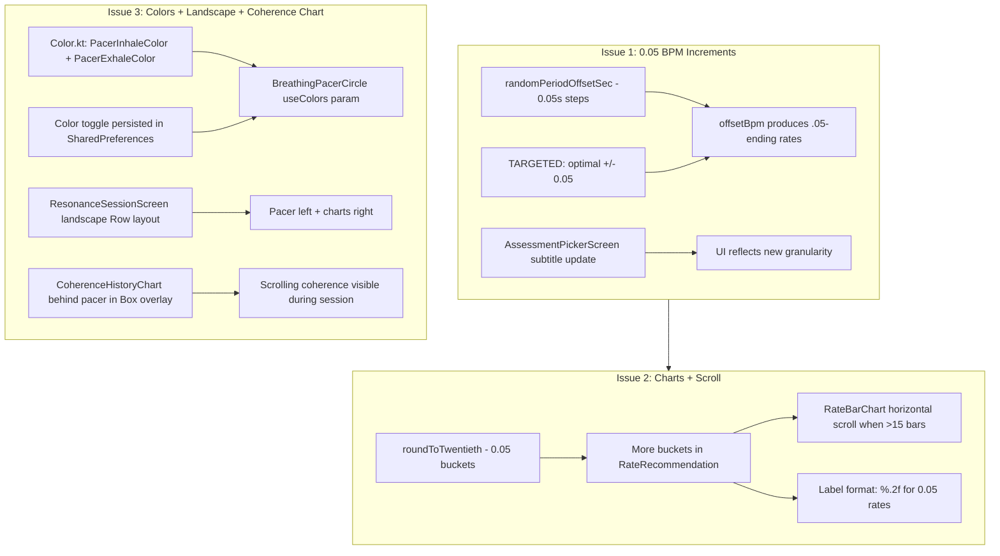

# Breathing UI Fixes Plan

**Created:** 2026-05-18  
**Issues:** #1779086229973, #1779086171420, #1778996898689

---

## Issue 1: Allow 0.05 BPM increments in assessment rate selection

### Problem
The random period offset in [`RfAssessmentOrchestrator.randomPeriodOffsetSec()`](app/src/main/java/com/example/wags/domain/usecase/breathing/RfAssessmentOrchestrator.kt:418) uses 0.1-second steps (tenths), which when converted back to BPM via [`offsetBpm()`](app/src/main/java/com/example/wags/domain/usecase/breathing/RfAssessmentOrchestrator.kt:429) produces rates that tend to cluster around 0.1 BPM endings. Rates ending in .05 (e.g. 5.05, 5.15) are never generated. Additionally, the TARGETED protocol only tests `optimalBpm ± 0.1` steps.

### Root Cause
- `randomPeriodOffsetSec()` generates offsets in tenths of a second: `(-9..9).random() / 10f`
- TARGETED protocol hardcodes `±0.1f` offsets at [line 472](app/src/main/java/com/example/wags/domain/usecase/breathing/RfAssessmentOrchestrator.kt:472)
- The subtitle in [`AssessmentPickerScreen`](app/src/main/java/com/example/wags/ui/breathing/AssessmentPickerScreen.kt:67) says "Optimal ±0.1 BPM"

### Fix
1. **Change `randomPeriodOffsetSec()`** to use twentieths of a second (0.05s steps):
   ```kotlin
   val twentieths = (-18..18).random()
   return twentieths / 20f  // -0.90 to +0.90 in 0.05s steps
   ```
2. **Change TARGETED protocol** to test `optimalBpm ± 0.05` instead of `± 0.1`:
   ```kotlin
   listOf(
       offsetBpm(optimalBpm, offset) to 1.0f,
       offsetBpm(optimalBpm + 0.05f, offset) to 1.0f,
       offsetBpm(optimalBpm - 0.05f, offset) to 1.0f
   ).shuffled()
   ```
3. **Update subtitle** in `AssessmentPickerScreen` PROTOCOL_LIST from `"Optimal ±0.1 BPM × 3 min"` to `"Optimal ±0.05 BPM × 3 min"`

### Files to modify
- [`RfAssessmentOrchestrator.kt`](app/src/main/java/com/example/wags/domain/usecase/breathing/RfAssessmentOrchestrator.kt) — `randomPeriodOffsetSec()` + TARGETED params
- [`AssessmentPickerScreen.kt`](app/src/main/java/com/example/wags/ui/breathing/AssessmentPickerScreen.kt) — subtitle text

---

## Issue 2: Show 0.05-increment rates in recommendation charts + horizontal scroll

### Problem
[`ResonanceRateRecommender.roundToTenth()`](app/src/main/java/com/example/wags/domain/usecase/breathing/ResonanceRateRecommender.kt:228) groups all data into 0.1 BPM buckets, so sessions at 5.05 BPM get rounded to 5.1 and their distinct identity is lost. Once we fix this to 0.05 granularity, the bar charts will have up to ~2× more bars, making them too narrow to read labels.

### Root Cause
- `roundToTenth()` at [line 228](app/src/main/java/com/example/wags/domain/usecase/breathing/ResonanceRateRecommender.kt:228): `(value * 10).roundToInt() / 10f`
- `RateBucket` doc says "rounded to 0.1" at [line 34](app/src/main/java/com/example/wags/domain/usecase/breathing/ResonanceRateRecommender.kt:34)
- Labels in [`RateRecommendationScreen`](app/src/main/java/com/example/wags/ui/breathing/RateRecommendationScreen.kt:215) use `"%.1f"` format
- Labels in [`BucketCard`](app/src/main/java/com/example/wags/ui/breathing/RateRecommendationScreen.kt:323) use `"%.1f BPM"` format
- [`RateBarChart`](app/src/main/java/com/example/wags/ui/common/RateBarChart.kt) has no horizontal scroll — bars just compress to fit `fillMaxWidth()`

### Fix

#### Step 1: Change bucketing to 0.05 granularity
In `ResonanceRateRecommender`:
- Rename `roundToTenth()` → `roundToTwentieth()`:
  ```kotlin
  private fun roundToTwentieth(value: Float): Float {
      return (value * 20).roundToInt() / 20f
  }
  ```
- Update the call at [line 174](app/src/main/java/com/example/wags/domain/usecase/breathing/ResonanceRateRecommender.kt:174): `groupBy { roundToTwentieth(it.rateBpm) }`
- Update `RateBucket` doc comment from "rounded to 0.1" to "rounded to 0.05"

#### Step 2: Update label formatting
In `RateRecommendationScreen`:
- Change `"%.1f".format(it.rateBpm)` → `"%.2f".format(it.rateBpm)` for all 4 chart label mappings (lines 215, 229, 244, 258)
- Change `"%.1f BPM".format(bucket.rateBpm)` → `"%.2f BPM".format(bucket.rateBpm)` in BucketCard (line 323)

#### Step 3: Make RateBarChart horizontally scrollable when >15 bars
In `RateBarChart.kt`:
- Add a `minBarWidthDp` parameter (default ~32.dp) 
- Calculate the minimum chart width needed: `entries.size * minBarWidthDp`
- When entries.size > 15, wrap the Canvas in a `rememberScrollState()` + `horizontalScroll` modifier
- Set the canvas width to `max(fillMaxWidth, minWidthForBars)` so it extends beyond the viewport when needed
- Implementation approach:
  ```kotlin
  val minChartWidth = maxOf(entries.size * 32.dp, ???) // calculate from min bar width
  val needsScroll = entries.size > 15
  
  Box(modifier = if (needsScroll) Modifier.horizontalScroll(rememberScrollState()) else Modifier) {
      Canvas(
          modifier = Modifier
              .width(if (needsScroll) minChartWidth else FillWholeWidth)
              .height(200.dp)
              ...
      )
  }
  ```

### Files to modify
- [`ResonanceRateRecommender.kt`](app/src/main/java/com/example/wags/domain/usecase/breathing/ResonanceRateRecommender.kt) — bucketing granularity
- [`RateRecommendationScreen.kt`](app/src/main/java/com/example/wags/ui/breathing/RateRecommendationScreen.kt) — label formatting
- [`RateBarChart.kt`](app/src/main/java/com/example/wags/ui/common/RateBarChart.kt) — horizontal scroll support

---

## Issue 3: Color option for inhale/exhale + landscape layout + scrolling coherence chart

### Problem
1. The pacer circle uses greyscale colors ([`PacerInhale = Color(0xFFD0D0D0)`](app/src/main/java/com/example/wags/ui/theme/Color.kt:37), [`PacerExhale = Color(0xFF606060)`](app/src/main/java/com/example/wags/ui/theme/Color.kt:38)) — hard to distinguish in peripheral vision
2. The session screen layout is a single `Column` with `verticalScroll` — not optimized for landscape
3. The coherence score chart is not shown during the active session on `ResonanceSessionScreen` (only RR interval and RMSSD charts are shown); the user wants a coherence chart scrolling behind the pacer circle

### Current Layout (ResonanceSessionScreen BREATHING phase)
```
Column(verticalScroll) {
    BreathingPacerCircle(200.dp)
    RsSessionStatsRow
    LinearProgressIndicator
    RsHrvMetricsRow
    RrIntervalChart(100.dp)
    RmssdChart(100.dp)
    EndSessionButton
}
```

### Proposed Layout

#### Portrait: Box overlay with coherence chart behind pacer
```
Box {
    // Coherence chart fills the background area behind the pacer
    CoherenceHistoryChart(modifier = Modifier.fillMaxWidth().height(200.dp).align(TopCenter))
    
    // Pacer circle overlaid on top
    BreathingPacerCircle(200.dp, modifier = Modifier.align(TopCenter))
}
RsSessionStatsRow
LinearProgressIndicator
RsHrvMetricsRow
RrIntervalChart(100.dp)
RmssdChart(100.dp)
EndSessionButton
```

#### Landscape: Row layout with pacer on left, charts on right
```
Row {
    // Left: Pacer + stats (fixed width ~40%)
    Column(weight = 0.4f) {
        Box {
            CoherenceHistoryChart(behind pacer)
            BreathingPacerCircle(160.dp)
        }
        RsSessionStatsRow
        RsHrvMetricsRow
        EndSessionButton
    }
    // Right: Charts (scrollable, ~60%)
    Column(weight = 0.6f, verticalScroll) {
        LinearProgressIndicator
        RrIntervalChart(100.dp)
        RmssdChart(100.dp)
    }
}
```

### Fix

#### Step 1: Add color toggle for inhale/exhale
- Add new color constants in [`Color.kt`](app/src/main/java/com/example/wags/ui/theme/Color.kt):
  ```kotlin
  // Colored pacer variants (for peripheral vision)
  val PacerInhaleColor = Color(0xFF4FC3F7)   // light blue
  val PacerExhaleColor = Color(0xFFFF8A65)   // warm orange
  ```
- Add a `useColors` parameter to [`BreathingPacerCircle`](app/src/main/java/com/example/wags/ui/breathing/BreathingPacerCircle.kt:50) (default `false`):
  ```kotlin
  @Composable
  fun BreathingPacerCircle(
      progress: Float,
      isInhaling: Boolean,
      modifier: Modifier = Modifier,
      size: Dp = 260.dp,
      showLabel: Boolean = true,
      overlayLabel: String? = null,
      useColors: Boolean = false,  // NEW
      onPhaseTransition: ((isInhaling: Boolean) -> Unit)? = null
  )
  ```
- In the color logic, when `useColors == true`, use `PacerInhaleColor`/`PacerExhaleColor` instead of greyscale
- Add a color-mode toggle icon button on `ResonanceSessionScreen` (next to the vibration toggle area, or in the top bar)
- Persist the color preference in SharedPreferences alongside the vibration toggle

#### Step 2: Add live coherence chart behind pacer circle
- The `BreathingUiState` already has [`coherenceHistory: List<Float>`](app/src/main/java/com/example/wags/ui/breathing/BreathingViewModel.kt:84) — we just need to render it during the session
- Extract or reuse the `CoherenceHistoryChart` composable from [`BreathingScreen.kt:560`](app/src/main/java/com/example/wags/ui/breathing/BreathingScreen.kt:560)
- Place it in a `Box` behind the `BreathingPacerCircle` so it scrolls behind the circle
- The chart should use semi-transparent background so the pacer circle remains clearly visible on top

#### Step 3: Landscape-optimized layout
- Use `LocalConfiguration.current` to detect orientation
- In landscape, switch from `Column` to `Row` layout as described above
- Reduce pacer circle size in landscape (200.dp → 160.dp) to leave room for charts
- The coherence chart behind the pacer should also scale down in landscape

### Files to modify
- [`Color.kt`](app/src/main/java/com/example/wags/ui/theme/Color.kt) — add colored pacer constants
- [`BreathingPacerCircle.kt`](app/src/main/java/com/example/wags/ui/breathing/BreathingPacerCircle.kt) — add `useColors` parameter
- [`ResonanceSessionScreen.kt`](app/src/main/java/com/example/wags/ui/breathing/ResonanceSessionScreen.kt) — landscape layout, coherence chart overlay, color toggle
- Possibly extract `CoherenceHistoryChart` to a shared composable if not already

---

## Execution Order

1. **Issue 1** — Change rate increment granularity (smallest change, foundational for Issue 2)
2. **Issue 2** — Update bucketing + chart labels + horizontal scroll (depends on Issue 1)
3. **Issue 3** — Color toggle + landscape + coherence chart overlay (independent UI work)

## Architecture Diagram


