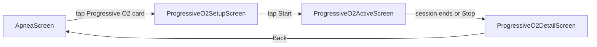
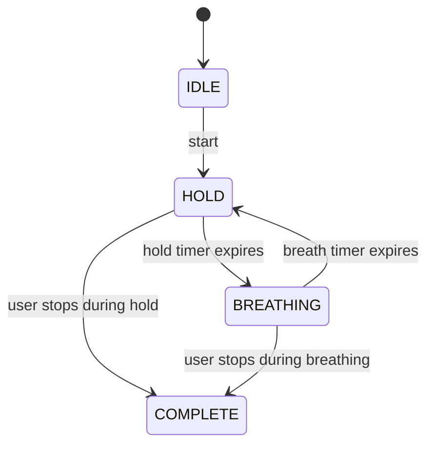

# Progressive O₂ Drill — Architecture Plan

*Created: 2026-04-09 14:51 UTC-6*

## 1. Overview

Revamp the Progressive O₂ drill from an inline accordion session on [`ApneaScreen.kt`](app/src/main/java/com/example/wags/ui/apnea/ApneaScreen.kt) into a **dedicated three-screen flow** with an **endless drill** model, user-configurable breath period, past session history, and a post-session detail screen with SpO₂/HR graphs.

### Navigation Flow



---

## 2. Key Design Decisions

### 2.1 New State Machine vs. Reusing AdvancedApneaStateMachine

**Decision: Create a new `ProgressiveO2StateMachine`.**

Rationale:
- [`AdvancedApneaStateMachine`](app/src/main/java/com/example/wags/domain/usecase/apnea/AdvancedApneaStateMachine.kt) is built around a **fixed round list** (`rounds: List<Pair<Long, Long>>`). The endless drill has no predetermined round count — rounds are generated on-the-fly as the user progresses.
- The existing state machine has `WAITING_FOR_BREATH`, `WONKA_CRUISING`, `WONKA_ENDURANCE`, and `RECOVERY` phases that are irrelevant to Progressive O₂. Adding endless logic would bloat it.
- A dedicated state machine is simpler (~120 lines), easier to test, and avoids regressions in the 4 other modalities that share `AdvancedApneaStateMachine`.
- The new state machine has only 4 phases: `IDLE`, `BREATHING`, `HOLD`, `COMPLETE`.

### 2.2 Data Storage Strategy

**Decision: Save one `ApneaRecordEntity` per session + one `ApneaSessionEntity` per session.**

- The `ApneaRecordEntity` is what appears in All Records, calendar, and stats. Its `durationMs` = the longest hold achieved. Its `tableType = "PROGRESSIVE_O2"`.
- The `ApneaSessionEntity` stores the full session metadata including per-round details in `tableParamsJson`.
- Telemetry goes into the existing `TelemetryEntity` table (FK → `apnea_sessions.sessionId`) for the session-level HR/SpO₂ graph.
- Additionally, `FreeHoldTelemetryEntity` rows (FK → `apnea_records.recordId`) are saved so the record detail screen can show HR/SpO₂ charts — same pattern as table sessions.

### 2.3 Breath Period Storage

**Decision: Store in `tableParamsJson` on `ApneaSessionEntity` + SharedPreferences for the default.**

- The user's chosen breath period is persisted in `apnea_prefs` SharedPreferences as `"prog_o2_breath_period_sec"` (default: 60).
- Each session's `tableParamsJson` includes `breathPeriodSec` so the history display knows what was used.
- Past sessions are queried from `ApneaSessionDao.getByType("PROGRESSIVE_O2")` to show the history cards on the setup screen.

### 2.4 Per-Round Records

**Decision: Only session-level records, NOT per-round `ApneaRecordEntity` rows.**

- One `ApneaRecordEntity` per session (longest hold as `durationMs`). This matches the pattern used by O₂/CO₂ table sessions.
- Per-round data (hold durations, timestamps) is stored in `tableParamsJson` on the `ApneaSessionEntity`.

### 2.5 Telemetry During Endless Drill

**Decision: Continuous collection throughout the entire session (holds + breathing periods).**

- Oximeter/HR samples are collected from session start to session end, same as table sessions.
- The detail screen can overlay hold/breathing phase boundaries on the HR/SpO₂ chart using the per-round timestamps from `tableParamsJson`.

---

## 3. Data Model Changes

### 3.1 No Schema Migration Needed

The existing tables are sufficient:
- `apnea_records` — already supports `tableType = "PROGRESSIVE_O2"` (TEXT column, no enum constraint)
- `apnea_sessions` — already supports `tableType = "PROGRESSIVE_O2"` with `tableParamsJson` for arbitrary JSON
- `telemetry` — FK to `apnea_sessions.sessionId`
- `free_hold_telemetry` — FK to `apnea_records.recordId`

**No DB migration 26→27 is required.** All new data fits within existing columns.

### 3.2 `tableParamsJson` Format for Progressive O₂

```json
{
  "breathPeriodSec": 60,
  "rounds": [
    {
      "round": 1,
      "holdTargetMs": 15000,
      "holdActualMs": 15000,
      "holdStartEpochMs": 1712700000000,
      "holdEndEpochMs": 1712700015000,
      "breathStartEpochMs": 1712700015000,
      "breathEndEpochMs": 1712700075000
    },
    {
      "round": 2,
      "holdTargetMs": 30000,
      "holdActualMs": 30000,
      "holdStartEpochMs": 1712700075000,
      "holdEndEpochMs": 1712700105000,
      "breathStartEpochMs": 1712700105000,
      "breathEndEpochMs": 1712700165000
    }
  ],
  "stoppedDuringHold": true,
  "lastHoldElapsedMs": 22000
}
```

- `stoppedDuringHold`: true if the user pressed Stop during a hold (vs. during a breathing period)
- `lastHoldElapsedMs`: how far into the final hold the user got before stopping (only meaningful when `stoppedDuringHold = true`)
- Each round's `holdActualMs` = actual time held (may differ from target if user stopped mid-hold)

### 3.3 New DAO Query

Add to [`ApneaSessionDao`](app/src/main/java/com/example/wags/data/db/dao/ApneaSessionDao.kt):

```kotlin
@Query("SELECT * FROM apnea_sessions WHERE tableType = 'PROGRESSIVE_O2' ORDER BY timestamp DESC")
suspend fun getProgressiveO2Sessions(): List<ApneaSessionEntity>
```

---

## 4. New Files to Create

### 4.1 State Machine

| File | Path | Description |
|------|------|-------------|
| `ProgressiveO2StateMachine.kt` | `domain/usecase/apnea/` | Endless drill state machine with IDLE → BREATHING → HOLD → BREATHING → ... → COMPLETE cycle |

### 4.2 Setup Screen

| File | Path | Description |
|------|------|-------------|
| `ProgressiveO2SetupScreen.kt` | `ui/apnea/` | Setup screen with breath period input, past session history cards, Start button |
| `ProgressiveO2SetupViewModel.kt` | `ui/apnea/` | Loads past sessions, manages breath period setting |

### 4.3 Active Screen

| File | Path | Description |
|------|------|-------------|
| `ProgressiveO2ActiveScreen.kt` | `ui/apnea/` | Active drill screen with timer, round counter, Stop button, phase indicator |
| `ProgressiveO2ActiveViewModel.kt` | `ui/apnea/` | Drives the state machine, collects telemetry, saves session on completion |

### 4.4 Detail Screen

| File | Path | Description |
|------|------|-------------|
| `ProgressiveO2DetailScreen.kt` | `ui/apnea/` | Post-session detail with HR/SpO₂ charts, round breakdown, analytics |
| `ProgressiveO2DetailViewModel.kt` | `ui/apnea/` | Loads session + telemetry data, computes analytics |

**Total new files: 7**

---

## 5. Existing Files to Modify

| File | Change |
|------|--------|
| [`WagsNavGraph.kt`](app/src/main/java/com/example/wags/ui/navigation/WagsNavGraph.kt) | Add 3 new routes + composable entries + helper functions |
| [`ApneaScreen.kt`](app/src/main/java/com/example/wags/ui/apnea/ApneaScreen.kt) | Replace inline Progressive O₂ session content with a navigation card that goes to the setup screen |
| [`ApneaSessionDao.kt`](app/src/main/java/com/example/wags/data/db/dao/ApneaSessionDao.kt) | Add `getProgressiveO2Sessions()` query |
| [`ApneaSessionRepository.kt`](app/src/main/java/com/example/wags/data/repository/ApneaSessionRepository.kt) | Add `getProgressiveO2Sessions()` wrapper |
| [`ApneaRecordDetailScreen.kt`](app/src/main/java/com/example/wags/ui/apnea/ApneaRecordDetailScreen.kt) | Handle `PROGRESSIVE_O2` tableType in the detail card (show session info like round count, breath period) |
| [`ApneaRecordDetailViewModel.kt`](app/src/main/java/com/example/wags/ui/apnea/ApneaRecordDetailViewModel.kt) | Load matching `ApneaSessionEntity` for Progressive O₂ records (already does this for table records via timestamp+type lookup) |

**No changes needed to:**
- [`AllApneaRecordsViewModel.kt`](app/src/main/java/com/example/wags/ui/apnea/AllApneaRecordsViewModel.kt) — already has `ApneaEventType("Progressive O₂", "PROGRESSIVE_O2")` in its filter list
- [`AllApneaRecordsScreen.kt`](app/src/main/java/com/example/wags/ui/apnea/AllApneaRecordsScreen.kt) — already shows table-type records with "Longest hold" subtitle
- [`WagsDatabase.kt`](app/src/main/java/com/example/wags/data/db/WagsDatabase.kt) — no schema changes
- [`DatabaseModule.kt`](app/src/main/java/com/example/wags/di/DatabaseModule.kt) — no new DAOs

---

## 6. State Machine Design

### 6.1 `ProgressiveO2StateMachine`

```
Location: domain/usecase/apnea/ProgressiveO2StateMachine.kt
```

**Phases:**



**State data class:**

```kotlin
data class ProgressiveO2State(
    val phase: ProgressiveO2Phase = ProgressiveO2Phase.IDLE,
    val currentRound: Int = 0,
    val holdTargetMs: Long = 0L,
    val timerMs: Long = 0L,
    val breathPeriodMs: Long = 60_000L,
    val totalHoldTimeMs: Long = 0L
)

enum class ProgressiveO2Phase {
    IDLE, HOLD, BREATHING, COMPLETE
}
```

**Key behaviors:**
- `start(breathPeriodSec: Int, scope: CoroutineScope)` — begins round 1 (15s hold) immediately (no initial breathing period)
- Hold durations: round 1 = 15s, round 2 = 30s, round 3 = 45s, ... (round N = N × 15s)
- After each hold countdown reaches 0, transitions to BREATHING for `breathPeriodMs`
- After breathing countdown reaches 0, transitions to next HOLD with +15s
- `stop()` — records where the user stopped and transitions to COMPLETE
- `totalHoldTimeMs` — running sum of completed hold durations (not breathing time)
- Timer counts DOWN during both HOLD and BREATHING phases
- The state machine is `@Singleton` injected via Hilt (same pattern as `AdvancedApneaStateMachine`)

**Round tracking:**
- The state machine maintains a `MutableList<RoundData>` internally with timestamps for each round
- On `stop()`, this list is exposed via a `fun getRoundData(): List<RoundData>` method for the ViewModel to serialize into `tableParamsJson`

---

## 7. Screen Layouts

### 7.1 ProgressiveO2SetupScreen

```
┌─────────────────────────────────────┐
│ ← Progressive O₂                   │
├─────────────────────────────────────┤
│                                     │
│  Breath Period                      │
│  ┌─────────────────────────────┐    │
│  │  60  seconds                │    │
│  └─────────────────────────────┘    │
│                                     │
│  Hold progression: 15s → 30s →      │
│  45s → 60s → ...                    │
│                                     │
│  ┌─────────────────────────────┐    │
│  │       [ Start Drill ]       │    │
│  └─────────────────────────────┘    │
│                                     │
│  ── Past Sessions ──────────────    │
│                                     │
│  ┌─────────────────────────────┐    │
│  │ Apr 8 · Breath: 60s         │    │
│  │ 8 rounds · Max hold: 2:00   │    │
│  │ Lowest SpO₂: 92%            │    │
│  └─────────────────────────────┘    │
│  ┌─────────────────────────────┐    │
│  │ Apr 5 · Breath: 45s         │    │
│  │ 6 rounds · Max hold: 1:30   │    │
│  │ Lowest SpO₂: 94%            │    │
│  └─────────────────────────────┘    │
│                                     │
└─────────────────────────────────────┘
```

**Components:**
- `OutlinedTextField` for breath period (numeric keyboard, seconds)
- Summary text showing the hold progression formula
- Start button (always enabled — no HR monitor required)
- `LazyColumn` of past session cards loaded from `ApneaSessionDao.getProgressiveO2Sessions()`
- Each card shows: date, breath period used, rounds completed, max hold reached, lowest SpO₂ (if available)
- Tapping a past session card navigates to `ProgressiveO2DetailScreen` for that session

### 7.2 ProgressiveO2ActiveScreen

```
┌─────────────────────────────────────┐
│ ← Progressive O₂                   │
├─────────────────────────────────────┤
│                                     │
│         Round 3 of ∞                │
│                                     │
│           HOLD                      │
│                                     │
│          0:32                       │
│        ─────────                    │
│       target: 0:45                  │
│                                     │
│   Total hold time: 1:17            │
│                                     │
│                                     │
│                                     │
│  ┌─────────────────────────────┐    │
│  │         [ Stop ]            │    │
│  └─────────────────────────────┘    │
│                                     │
└─────────────────────────────────────┘
```

**Components:**
- Phase label: "HOLD" (colored) or "BREATHE" (colored differently)
- Large countdown timer (mm:ss)
- Target duration for current hold
- Running total of hold time accumulated
- Round counter showing "Round N of ∞"
- Stop button (always visible)
- `KeepScreenOn` + `SessionBackHandler` (same pattern as [`AdvancedApneaScreen`](app/src/main/java/com/example/wags/ui/apnea/AdvancedApneaScreen.kt))
- Audio/haptic cues via [`ApneaAudioHapticEngine`](app/src/main/java/com/example/wags/domain/usecase/apnea/ApneaAudioHapticEngine.kt): chime on hold start, vibrate on hold end, tick during last 10s of breathing

### 7.3 ProgressiveO2DetailScreen

```
┌─────────────────────────────────────┐
│ ← Session Detail                    │
├─────────────────────────────────────┤
│                                     │
│  Progressive O₂ · Apr 9, 2026      │
│                                     │
│  ┌─────────────────────────────┐    │
│  │ Rounds: 8                   │    │
│  │ Max Hold: 2:00              │    │
│  │ Total Hold Time: 9:00       │    │
│  │ Breath Period: 60s          │    │
│  │ Session Duration: 17:00     │    │
│  │ Lowest SpO₂: 92%           │    │
│  │ Max HR: 98 bpm              │    │
│  └─────────────────────────────┘    │
│                                     │
│  ── SpO₂ ──────────────────────     │
│  ┌─────────────────────────────┐    │
│  │  [SpO₂ line chart]          │    │
│  │  with hold/breathe shading  │    │
│  └─────────────────────────────┘    │
│                                     │
│  ── Heart Rate ────────────────     │
│  ┌─────────────────────────────┐    │
│  │  [HR line chart]            │    │
│  │  with hold/breathe shading  │    │
│  └─────────────────────────────┘    │
│                                     │
│  ── Round Breakdown ───────────     │
│  Round 1: 15s hold ✓               │
│  Round 2: 30s hold ✓               │
│  Round 3: 45s hold ✓               │
│  ...                                │
│  Round 8: 2:00 hold ✓              │
│                                     │
└─────────────────────────────────────┘
```

**Components:**
- Summary card with key metrics
- SpO₂ line chart (Canvas-based, same pattern as existing detail screens)
- HR line chart (Canvas-based)
- Both charts have alternating background shading for hold (reddish) vs. breathing (bluish) phases, using the epoch timestamps from `tableParamsJson`
- Round breakdown list showing each round's target and whether it was completed
- The last round shows actual elapsed time if the user stopped mid-hold

---

## 8. Navigation Routes

Add to [`WagsRoutes`](app/src/main/java/com/example/wags/ui/navigation/WagsNavGraph.kt:53):

```kotlin
// In WagsRoutes object:
const val PROGRESSIVE_O2_SETUP = "progressive_o2_setup"
const val PROGRESSIVE_O2_ACTIVE = "progressive_o2_active/{breathPeriodSec}"
const val PROGRESSIVE_O2_DETAIL = "progressive_o2_detail/{sessionId}"

fun progressiveO2Active(breathPeriodSec: Int) = "progressive_o2_active/$breathPeriodSec"
fun progressiveO2Detail(sessionId: Long) = "progressive_o2_detail/$sessionId"
```

Add 3 `composable()` entries in `WagsNavGraph`:

```kotlin
composable(WagsRoutes.PROGRESSIVE_O2_SETUP) {
    ProgressiveO2SetupScreen(navController = navController)
}
composable(WagsRoutes.PROGRESSIVE_O2_ACTIVE) { backStackEntry ->
    val breathPeriodSec = backStackEntry.arguments?.getString("breathPeriodSec")?.toIntOrNull() ?: 60
    ProgressiveO2ActiveScreen(
        navController = navController,
        breathPeriodSec = breathPeriodSec
    )
}
composable(WagsRoutes.PROGRESSIVE_O2_DETAIL) { backStackEntry ->
    val sessionId = backStackEntry.arguments?.getString("sessionId")?.toLongOrNull() ?: 0L
    ProgressiveO2DetailScreen(
        navController = navController,
        sessionId = sessionId
    )
}
```

---

## 9. Integration Points

### 9.1 ApneaScreen Changes

In [`ApneaScreen.kt`](app/src/main/java/com/example/wags/ui/apnea/ApneaScreen.kt), replace the current `CollapsibleCard` for Progressive O₂ (which contains `InlineAdvancedSessionContent`) with a simple navigation card:

```kotlin
// Replace the CollapsibleCard + InlineAdvancedSessionContent with:
Card(
    modifier = Modifier.fillMaxWidth().clickable {
        navController.navigate(WagsRoutes.PROGRESSIVE_O2_SETUP)
    }
) {
    Row(verticalAlignment = Alignment.CenterVertically) {
        Text("Progressive O₂", style = MaterialTheme.typography.titleMedium)
        Spacer(Modifier.weight(1f))
        Text("→", color = TextSecondary)
    }
}
```

This removes the dependency on `AdvancedApneaStateMachine` for Progressive O₂ from `ApneaViewModel`.

### 9.2 ApneaViewModel Changes

Remove the Progressive O₂ inline session logic from [`ApneaViewModel`](app/src/main/java/com/example/wags/ui/apnea/ApneaViewModel.kt) (the `startAdvancedSession(TrainingModality.PROGRESSIVE_O2)` and `stopAdvancedSession()` calls). The other modalities (MIN_BREATH, WONKA_*) that still use inline sessions remain unchanged.

### 9.3 ApneaRecordDetailScreen Integration

In [`ApneaRecordDetailScreen.kt`](app/src/main/java/com/example/wags/ui/apnea/ApneaRecordDetailScreen.kt), the existing table session detail card already handles `PROGRESSIVE_O2` records via the `tableSession: ApneaSessionEntity?` parameter. The `tableParamsJson` will be parsed to show:
- Breath period used
- Number of rounds completed
- Per-round hold durations
- Whether the session was stopped during a hold or breathing period

### 9.4 History/Calendar Integration

Already works — no changes needed:
- [`AllApneaRecordsViewModel`](app/src/main/java/com/example/wags/ui/apnea/AllApneaRecordsViewModel.kt:59) already has `ApneaEventType("Progressive O₂", "PROGRESSIVE_O2")` in its filter list
- [`AllApneaRecordsScreen`](app/src/main/java/com/example/wags/ui/apnea/AllApneaRecordsScreen.kt) already shows table-type records with type as primary text and "Longest hold" subtitle
- Calendar view in [`ApneaHistoryScreen`](app/src/main/java/com/example/wags/ui/apnea/ApneaHistoryScreen.kt) shows all `ApneaRecordEntity` rows regardless of `tableType`

### 9.5 AdvancedApneaStateMachine Cleanup

The `PROGRESSIVE_O2` branch in [`AdvancedApneaStateMachine.buildRounds()`](app/src/main/java/com/example/wags/domain/usecase/apnea/AdvancedApneaStateMachine.kt:212) can be left in place (dead code) or removed. Removing is cleaner but optional — it won't be called once the ApneaScreen no longer launches Progressive O₂ through the advanced apnea flow.

Similarly, [`ProgressiveO2Generator`](app/src/main/java/com/example/wags/domain/usecase/apnea/ProgressiveO2Generator.kt) becomes dead code and can be deleted or left in place.

---

## 10. Telemetry Collection Pattern

The active screen ViewModel follows the same telemetry collection pattern as [`ApneaViewModel.startTableSession()`](app/src/main/java/com/example/wags/ui/apnea/ApneaViewModel.kt):

1. On session start: set `oximeterIsPrimary`, clear `oximeterSamples`, start `oximeterCollectionJob` polling `hrDataSource` every ~1 second
2. Each poll: read latest HR (from RR intervals) and SpO₂ (from oximeter), append to in-memory `oximeterSamples` list
3. On session end:
   - Snapshot the samples list
   - Compute aggregates: `maxHrBpm`, `lowestSpO2`, `minHrBpm`
   - Save `ApneaRecordEntity` with aggregates → get `recordId`
   - Save `FreeHoldTelemetryEntity` rows linked to `recordId`
   - Save `ApneaSessionEntity` with `tableParamsJson` → get `sessionId`
   - Save `TelemetryEntity` rows linked to `sessionId`
4. Navigate to detail screen with `sessionId`

---

## 11. Implementation Checklist

These are the ordered steps for implementation:

- [ ] Create `ProgressiveO2StateMachine.kt` in `domain/usecase/apnea/`
- [ ] Add `getProgressiveO2Sessions()` to `ApneaSessionDao` and `ApneaSessionRepository`
- [ ] Create `ProgressiveO2SetupViewModel.kt` in `ui/apnea/`
- [ ] Create `ProgressiveO2SetupScreen.kt` in `ui/apnea/`
- [ ] Create `ProgressiveO2ActiveViewModel.kt` in `ui/apnea/`
- [ ] Create `ProgressiveO2ActiveScreen.kt` in `ui/apnea/`
- [ ] Create `ProgressiveO2DetailViewModel.kt` in `ui/apnea/`
- [ ] Create `ProgressiveO2DetailScreen.kt` in `ui/apnea/`
- [ ] Add 3 routes to `WagsRoutes` + 3 composable entries in `WagsNavGraph`
- [ ] Modify `ApneaScreen.kt`: replace inline Progressive O₂ section with navigation card
- [ ] Modify `ApneaRecordDetailScreen.kt`: enhance Progressive O₂ session detail card with round breakdown and breath period display
- [ ] Clean up: optionally remove `PROGRESSIVE_O2` branch from `AdvancedApneaStateMachine.buildRounds()` and delete `ProgressiveO2Generator.kt`
- [ ] Build and deploy to device

---

## 12. File Size Estimates

All new files should stay well under the 500-line limit:

| File | Estimated Lines |
|------|----------------|
| `ProgressiveO2StateMachine.kt` | ~120 |
| `ProgressiveO2SetupViewModel.kt` | ~80 |
| `ProgressiveO2SetupScreen.kt` | ~200 |
| `ProgressiveO2ActiveViewModel.kt` | ~250 |
| `ProgressiveO2ActiveScreen.kt` | ~250 |
| `ProgressiveO2DetailViewModel.kt` | ~100 |
| `ProgressiveO2DetailScreen.kt` | ~350 |

The active ViewModel is the largest because it handles telemetry collection, state machine orchestration, audio/haptic cues, and session saving. If it approaches 400 lines, the telemetry collection can be extracted into a shared helper.
