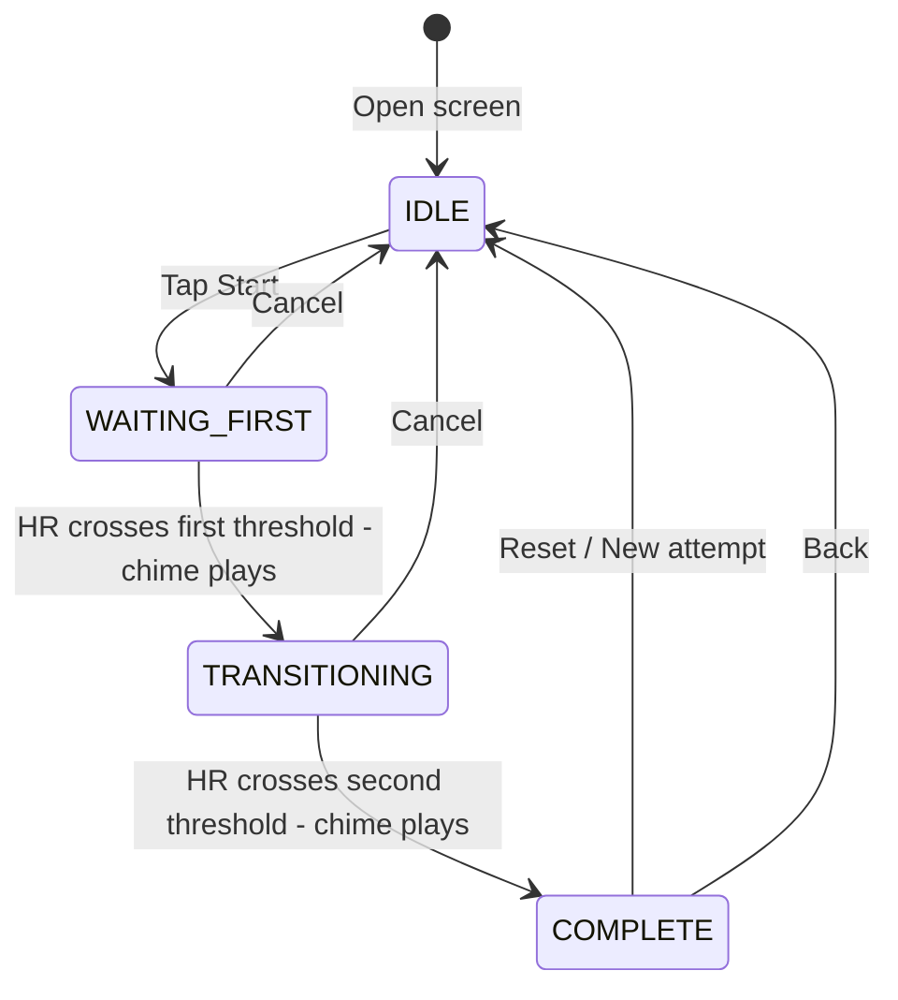

# Rapid HR Change — Architecture Plan

*Created: 2026-04-02 16:09 UTC-6*

## Overview

**Rapid HR Change** is a new 6th section on the WAGS dashboard. The user sets two HR thresholds (high and low), picks a direction (High→Low or Low→High), and the app times how quickly they can shift their heart rate from one threshold to the other. A chime plays when each threshold is crossed. All attempts are saved with full telemetry for history, stats, and personal bests.

## Concept & User Flow



### Direction Modes

| Mode | Phase 1 - WAITING_FIRST | Phase 2 - TRANSITIONING |
|------|------------------------|------------------------|
| **High → Low** | Get HR **above** the high threshold | Get HR **below** the low threshold |
| **Low → High** | Get HR **below** the low threshold | Get HR **above** the high threshold |

### Idle Screen UX

1. **Direction toggle** — Two large toggle buttons: `High → Low` and `Low → High`
2. **HR inputs** — Two number fields: "High HR" and "Low HR" with sensible defaults (e.g. 120 and 60)
3. **Preset cards** — Below the inputs, show previously-used setting combinations for the selected direction, each as a clickable card showing:
   - High HR / Low HR values
   - Best transition time for those settings
   - Number of attempts
   - Tap to auto-fill the inputs
4. **Start button** — Large button, disabled until HR monitor is connected
5. **History button** — Top bar action to navigate to history screen

### Active Session UX

1. **Phase indicator** — Large text showing current phase: "Get HR above 120" or "Get HR below 60"
2. **Live HR display** — Big number showing current HR in real-time
3. **Progress bar** — Visual indicator of how close HR is to the target threshold
4. **Timer** — Shows elapsed time since session started (Phase 1) or since first threshold crossed (Phase 2)
5. **Chime** — Plays `chime_end.mp3` when each threshold is crossed
6. **Cancel button** — Stops the session without saving

### Complete Screen UX

1. **Transition time** — The headline stat: time from first threshold crossed to second threshold crossed
2. **Total time** — Time from Start to completion
3. **Phase 1 time** — Time to reach the first threshold
4. **Phase 2 time** — The actual transition time (this is the "score")
5. **Peak/trough HR** — Highest and lowest HR recorded during the session
6. **HR at each threshold crossing** — Exact HR when each chime fired
7. **Personal best indicator** — If this is a new PB for these settings + direction
8. **HR chart** — Mini line chart of HR over the session with threshold lines drawn

## Data Model

### Entity: `RapidHrSessionEntity`

Stored in Room table `rapid_hr_sessions`.

| Column | Type | Description |
|--------|------|-------------|
| `id` | `Long` PK auto | Primary key |
| `timestamp` | `Long` | Epoch-ms when session started |
| `direction` | `String` | `HIGH_TO_LOW` or `LOW_TO_HIGH` |
| `highThreshold` | `Int` | High HR threshold in bpm |
| `lowThreshold` | `Int` | Low HR threshold in bpm |
| `phase1DurationMs` | `Long` | Time to reach first threshold |
| `transitionDurationMs` | `Long` | Time from first threshold to second threshold — the main score |
| `totalDurationMs` | `Long` | Total session time |
| `peakHrBpm` | `Int` | Highest HR during session |
| `troughHrBpm` | `Int` | Lowest HR during session |
| `hrAtFirstCrossing` | `Int` | HR when first threshold was crossed |
| `hrAtSecondCrossing` | `Int` | HR when second threshold was crossed |
| `avgHrBpm` | `Float?` | Average HR over entire session |
| `monitorId` | `String?` | BLE device label |
| `isPersonalBest` | `Boolean` | Whether this was a PB at time of recording |

### Entity: `RapidHrTelemetryEntity`

Stored in Room table `rapid_hr_telemetry`. One row per ~1-second HR sample.

| Column | Type | Description |
|--------|------|-------------|
| `id` | `Long` PK auto | Primary key |
| `sessionId` | `Long` FK | References `rapid_hr_sessions.id` |
| `offsetMs` | `Long` | Milliseconds since session start |
| `hrBpm` | `Int` | Heart rate at this sample |
| `phase` | `String` | `WAITING_FIRST` or `TRANSITIONING` |

## File Structure

Following existing patterns, all new files go under feature-based packages:

### Data Layer
- [`data/db/entity/RapidHrSessionEntity.kt`](app/src/main/java/com/example/wags/data/db/entity/RapidHrSessionEntity.kt) — Room entity
- [`data/db/entity/RapidHrTelemetryEntity.kt`](app/src/main/java/com/example/wags/data/db/entity/RapidHrTelemetryEntity.kt) — Room telemetry entity
- [`data/db/dao/RapidHrSessionDao.kt`](app/src/main/java/com/example/wags/data/db/dao/RapidHrSessionDao.kt) — DAO with queries for history, presets, PBs
- [`data/db/dao/RapidHrTelemetryDao.kt`](app/src/main/java/com/example/wags/data/db/dao/RapidHrTelemetryDao.kt) — DAO for telemetry CRUD
- [`data/repository/RapidHrRepository.kt`](app/src/main/java/com/example/wags/data/repository/RapidHrRepository.kt) — Repository wrapping both DAOs

### UI Layer
- [`ui/rapidhr/RapidHrScreen.kt`](app/src/main/java/com/example/wags/ui/rapidhr/RapidHrScreen.kt) — Main screen (idle + active + complete states)
- [`ui/rapidhr/RapidHrViewModel.kt`](app/src/main/java/com/example/wags/ui/rapidhr/RapidHrViewModel.kt) — ViewModel with state machine, HR polling, timer
- [`ui/rapidhr/RapidHrHistoryScreen.kt`](app/src/main/java/com/example/wags/ui/rapidhr/RapidHrHistoryScreen.kt) — History with graphs + calendar tabs
- [`ui/rapidhr/RapidHrHistoryViewModel.kt`](app/src/main/java/com/example/wags/ui/rapidhr/RapidHrHistoryViewModel.kt) — History data loading + chart computation
- [`ui/rapidhr/RapidHrDetailScreen.kt`](app/src/main/java/com/example/wags/ui/rapidhr/RapidHrDetailScreen.kt) — Individual session detail with HR chart
- [`ui/rapidhr/RapidHrDetailViewModel.kt`](app/src/main/java/com/example/wags/ui/rapidhr/RapidHrDetailViewModel.kt) — Loads session + telemetry for detail view

### Integration Points (existing files to modify)
- [`data/db/WagsDatabase.kt`](app/src/main/java/com/example/wags/data/db/WagsDatabase.kt) — Add entities, DAOs, migration 24→25
- [`di/DatabaseModule.kt`](app/src/main/java/com/example/wags/di/DatabaseModule.kt) — Provide new DAOs
- [`ui/navigation/WagsNavGraph.kt`](app/src/main/java/com/example/wags/ui/navigation/WagsNavGraph.kt) — Add routes + composable entries
- [`ui/dashboard/DashboardScreen.kt`](app/src/main/java/com/example/wags/ui/dashboard/DashboardScreen.kt) — Add 6th NavigationCard

## DAO Queries

Key queries for `RapidHrSessionDao`:

```kotlin
// All sessions ordered by newest first
@Query("SELECT * FROM rapid_hr_sessions ORDER BY timestamp DESC")
fun observeAll(): Flow<List<RapidHrSessionEntity>>

// Sessions filtered by direction
@Query("SELECT * FROM rapid_hr_sessions WHERE direction = :direction ORDER BY timestamp DESC")
fun observeByDirection(direction: String): Flow<List<RapidHrSessionEntity>>

// Distinct setting combos for preset cards (direction + high + low)
@Query("""
    SELECT direction, highThreshold, lowThreshold, 
           MIN(transitionDurationMs) as bestTimeMs,
           COUNT(*) as attemptCount
    FROM rapid_hr_sessions 
    WHERE direction = :direction
    GROUP BY highThreshold, lowThreshold 
    ORDER BY COUNT(*) DESC
""")
fun getPresetsByDirection(direction: String): Flow<List<RapidHrPreset>>

// Personal best for specific settings
@Query("""
    SELECT MIN(transitionDurationMs) FROM rapid_hr_sessions 
    WHERE direction = :direction AND highThreshold = :high AND lowThreshold = :low
""")
suspend fun getBestTransitionTime(direction: String, high: Int, low: Int): Long?

// Single session by ID
@Query("SELECT * FROM rapid_hr_sessions WHERE id = :id")
suspend fun getById(id: Long): RapidHrSessionEntity?
```

## Navigation Routes

```kotlin
// In WagsRoutes
const val RAPID_HR = "rapid_hr"
const val RAPID_HR_HISTORY = "rapid_hr_history"
const val RAPID_HR_DETAIL = "rapid_hr_detail/{sessionId}"

fun rapidHrDetail(sessionId: Long) = "rapid_hr_detail/$sessionId"
```

## ViewModel State Machine

```kotlin
enum class RapidHrPhase {
    IDLE,            // Setting up — choosing direction, thresholds
    WAITING_FIRST,   // Session started, waiting for HR to cross first threshold
    TRANSITIONING,   // First threshold crossed, timing the transition
    COMPLETE         // Second threshold crossed, showing results
}
```

The ViewModel will:
1. Poll `HrDataSource.liveHr` every ~500ms during active phases
2. Record telemetry samples every ~1 second
3. Compare live HR against thresholds to detect crossings
4. Play `chime_end.mp3` via `MediaPlayer` on each crossing (same pattern as meditation timer)
5. Compute stats and save to DB on completion
6. Check for personal best against existing records for same settings

## Value-Add Features Beyond Basic Requirements

1. **Preset cards with best times** — Previously-used setting combos shown as tappable cards with PB times, making repeat sessions one-tap
2. **HR progress bar** — Visual indicator showing how close the user's HR is to the target, providing real-time biofeedback
3. **Phase 1 vs Phase 2 timing** — Separating "get to start" time from "transition" time gives cleaner data
4. **Full telemetry** — Per-second HR recording enables the detail screen to show an HR chart with threshold lines overlaid
5. **Personal best tracking** — PB detection per settings combo + direction, consistent with apnea PB pattern
6. **History with graphs** — Trend charts showing transition time improvement over sessions
7. **Calendar view** — Same calendar pattern as meditation history for seeing session frequency

## DB Migration

Migration 24→25 creates two new tables:

```sql
CREATE TABLE rapid_hr_sessions (
    id INTEGER PRIMARY KEY AUTOINCREMENT NOT NULL,
    timestamp INTEGER NOT NULL,
    direction TEXT NOT NULL,
    highThreshold INTEGER NOT NULL,
    lowThreshold INTEGER NOT NULL,
    phase1DurationMs INTEGER NOT NULL,
    transitionDurationMs INTEGER NOT NULL,
    totalDurationMs INTEGER NOT NULL,
    peakHrBpm INTEGER NOT NULL,
    troughHrBpm INTEGER NOT NULL,
    hrAtFirstCrossing INTEGER NOT NULL,
    hrAtSecondCrossing INTEGER NOT NULL,
    avgHrBpm REAL,
    monitorId TEXT,
    isPersonalBest INTEGER NOT NULL DEFAULT 0
);

CREATE TABLE rapid_hr_telemetry (
    id INTEGER PRIMARY KEY AUTOINCREMENT NOT NULL,
    sessionId INTEGER NOT NULL,
    offsetMs INTEGER NOT NULL,
    hrBpm INTEGER NOT NULL,
    phase TEXT NOT NULL,
    FOREIGN KEY (sessionId) REFERENCES rapid_hr_sessions(id) ON DELETE CASCADE
);

CREATE INDEX index_rapid_hr_telemetry_sessionId ON rapid_hr_telemetry(sessionId);
```

## Implementation Order

1. Data layer: entities, DAOs, migration, repository
2. WagsDatabase + DatabaseModule updates
3. ViewModel + UI state
4. Main screen (idle → active → complete)
5. Navigation integration (routes + dashboard card)
6. History screen + history ViewModel
7. Detail screen + detail ViewModel
8. Sound playback integration
9. Build & deploy
