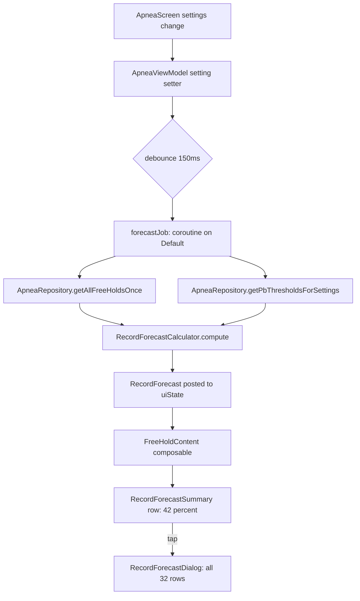

# Free-Hold Record-Breaking Forecast — Tier C Plan

**Created:** 2026-04-17 08:40 UTC-4
**Status:** Proposed — pending user approval
**Target feature tier:** C (log-linear regression with training-trend term)
**Future tiers reserved for later:** D (cross-drill covariates), E (per-day state: readiness, HRV, sleep, interactions)

---

## 1. Feature summary

Before starting a free hold, the main apnea screen's **Free Hold** collapsible card will show a single percentage:

> **Chance to beat PB for current settings: 42%**

Tapping that percentage opens a **popup dialog** showing the full 32-record breakdown (global, 5 single-setting, 10 pair, 10 triple, 5 quad, 1 exact) with their individual probabilities. The popup is the only place the expanded numbers live — the main card stays clean.

**Special case (explicit rule from user):** If the user's current 5-setting combination has **zero** prior free-hold records, the exact-combo probability is **100%** (any completed hold beats an empty history). This rule applies only to the exact cell; broader categories still use the model.

---

## 2. What the forecast is, precisely

For each of the 32 PB categories the user might break on the next hold, compute:

```
P(next_hold_duration > category_PB_threshold | current settings, training trend)
```

The "current settings" refers to whatever is set on the apnea screen at the moment. The probability distribution of `next_hold_duration` comes from a **log-linear regression** fit on all of the user's prior free-hold records.

---

## 3. The model (Tier C)

### 3.1 Training data

- **Source:** [`ApneaRecordEntity`](app/src/main/java/com/example/wags/data/db/entity/ApneaRecordEntity.kt:8) rows where `tableType IS NULL` (free holds only).
- **Minimum row filter:** `durationMs >= 10_000` (drop abandonments and accidental taps).
- **No cross-drill data.** Explicitly excluded for Tier C.

### 3.2 Model specification

Fit ordinary least squares on log-seconds:

```
y = log(durationMs / 1000)

y ~ β0
    + β_lung[lungVolume]         // 2 dummies (FULL, PARTIAL; EMPTY = reference)
    + β_prep[prepType]           // 2 dummies (RESONANCE, HYPER; NO_PREP = reference)
    + β_tod[timeOfDay]           // 2 dummies (DAY, NIGHT; MORNING = reference)
    + β_pos[posture]             // 1 dummy (SITTING; LAYING = reference)
    + β_aud[audio]               // 3 dummies (MUSIC, MOVIE, GUIDED; SILENCE = reference)
    + β_trend · days_since_first_hold
    + ε,      ε ~ Normal(0, σ²)
```

- **Why log-seconds:** hold times are right-skewed; a +10% effect is more plausibly constant than a +20-second effect.
- **Why these reference levels:** chosen to be the most common levels so `β0` is interpretable. Reference choice does not affect predictions, only interpretation.
- **Feature count:** 1 intercept + 2 + 2 + 2 + 1 + 3 + 1 = **12 parameters**. With an N ≈ 50 minimum sample requirement, each parameter has ~4 observations per dummy category — crude but defensible.

### 3.3 Closed-form solver

Use the normal equations with a ridge penalty:
```
β = (XᵀX + λI)⁻¹ Xᵀy
σ² = (1/(n-p)) · Σ(y_i − ŷ_i)²
```
- Small ridge `λ = 0.01` to keep the matrix well-conditioned when a rare level has very few rows.
- Pure Kotlin implementation; no external math library. Matrix dimensions are tiny (≤ 12×12), Gaussian elimination is fine.
- **Compute cost:** sub-millisecond for ≤ 10,000 rows.

### 3.4 Prediction for the pending hold

Given the current 5 settings `s`:

```
μ_s = Xᵀ_s · β                          // predicted mean log-seconds
σ_pred² = σ² + Xᵀ_s (XᵀX + λI)⁻¹ X_s     // includes parameter uncertainty
```

For each of the 32 PB categories with threshold `R` seconds:
```
P_i = P(T_s > R)
    = 1 − Φ((log R − μ_s) / √σ_pred²)
```

where Φ is the standard-normal CDF (implement via `java.lang.Math.erf`-equivalent; Kotlin's `kotlin.math` has enough primitives to build one).

### 3.5 "Beat any record" (the main card's single number)

The card shows **only one** probability: *chance of beating the EXACT-combo PB for the currently-set 5 settings.*

- If `N_exact == 0`: display **100%**.
- If `N_exact ≥ 1`: `P_exact = 1 − Φ((log R_exact − μ_s) / √σ_pred²)`.

The broader categories (global, 5-single, 10-pair, 10-triple, 5-quad) are displayed **only in the popup**.

### 3.6 Fallback behavior (insufficient data)

- **N_total < 20 free holds:** do not fit the model. Show "**Not enough data**" in the card. Tapping still opens the popup but every row reads "—". This is honest and prevents garbage numbers in month one.
- **N_total ≥ 20 and < 50:** fit the model but attach a "🔴 Low confidence" pill to every number.
- **N_total ≥ 50 and < 150:** "🟡 Medium confidence" pill.
- **N_total ≥ 150:** "🟢 High confidence" pill.

Confidence pills live in the popup only; the main card shows just the number (no pill) to keep it clean.

### 3.7 Empirical-Bayes shrinkage for the EXACT cell

The regression's prediction for the exact cell is always a smooth function of the dummies. If the user has many holds *in that exact cell*, we should trust the cell's own sample mean more than the regression.

Blend:
```
μ_exact = w · μ_cell + (1 − w) · μ_regression
w = N_cell / (N_cell + k)        // k = 10 by default
```
- `N_cell = 0`  → w = 0, pure regression (but exact-cell PB = 0 means we short-circuit to 100% anyway).
- `N_cell = 10` → w = 0.5
- `N_cell = 30` → w = 0.75

This only applies to the **EXACT** category. All broader categories use the pure regression prediction, since they average across many cells already.

### 3.8 What Tier C does *not* do (deferred)

- No interaction terms (e.g. posture × lungVolume).
- No per-day covariates (readiness, sleep, last meal).
- No cross-drill features (CO₂ tables, min-breath counts).
- No time-of-training-session effect (warm-up hold vs. 4th hold of the session).
- No seasonality or weekday effects.

All of these are structured to be added as *more columns in X* without changing the solver. See §7 "Tier D/E hooks."

---

## 4. Architecture & file layout

All new code lives in the existing Clean-Architecture layers.

### 4.1 Domain layer — `domain/usecase/apnea/forecast/`

| File | Purpose |
|---|---|
| [`RecordForecast.kt`](app/src/main/java/com/example/wags/domain/usecase/apnea/forecast/RecordForecast.kt:1) | Data classes: `RecordForecast`, `CategoryForecast`, `ForecastConfidence` enum, `ForecastStatus` sealed class (Ready / InsufficientData / NoExactRecord). |
| [`FreeHoldFeatureExtractor.kt`](app/src/main/java/com/example/wags/domain/usecase/apnea/forecast/FreeHoldFeatureExtractor.kt:1) | Converts an `ApneaRecordEntity` (or a "pending hold" settings tuple) into the `Xᵀ` row vector. Centralizes dummy-coding and the training-trend term. |
| [`OlsRegression.kt`](app/src/main/java/com/example/wags/domain/usecase/apnea/forecast/OlsRegression.kt:1) | Pure-Kotlin Gaussian-elimination solver for `(XᵀX + λI)⁻¹ Xᵀy`. Returns `OlsFit(beta, residualVariance, xtxInverse, dof)`. Unit-testable in isolation. |
| [`NormalCdf.kt`](app/src/main/java/com/example/wags/domain/usecase/apnea/forecast/NormalCdf.kt:1) | Standard-normal CDF via Abramowitz-Stegun 26.2.17 approximation. Accuracy ~1e-7, sub-microsecond. |
| [`RecordForecastCalculator.kt`](app/src/main/java/com/example/wags/domain/usecase/apnea/forecast/RecordForecastCalculator.kt:1) | Orchestrator: takes `List<ApneaRecordEntity>` + `CurrentSettings` + `PbThresholds`, returns `RecordForecast`. Handles the special cases (N<20, N_exact==0, shrinkage). This is the public entry point. |

All files target < 200 lines. `RecordForecastCalculator` depends only on the other four — easy to unit-test.

### 4.2 Data layer — additions to `ApneaRepository`

- Add a suspend method `getAllFreeHoldsOnce(): List<ApneaRecordEntity>` that wraps a DAO query filtering `tableType IS NULL`. (Check the DAO — the existing `getAllOnce()` may already work; just filter downstream.)
- Add a suspend method `getPbThresholdsForSettings(settings): PbThresholds` — likely already exists for the real-time PB indication feature; reuse it.
- Keep the forecast computation **out of the repository** — repository returns raw data only.

### 4.3 UI layer — ViewModel changes

In [`ApneaViewModel`](app/src/main/java/com/example/wags/ui/apnea/ApneaViewModel.kt:1) (or wherever the apnea-screen VM lives):

- Add `recordForecast: RecordForecast?` to the UI state.
- Recompute the forecast whenever **any** of the 5 settings change *or* when the data set changes (e.g. after a new record is saved). Debounce setting changes by ~150 ms to avoid thrash while the user flips toggles.
- The forecast calc runs on `Dispatchers.Default`. One fit per change (≤ 1 ms); UI jank-free.

### 4.4 UI layer — Compose

Two pieces, both new files to keep ApneaScreen.kt from growing past 500 lines:

| File | Purpose |
|---|---|
| [`RecordForecastSummary.kt`](app/src/main/java/com/example/wags/ui/apnea/forecast/RecordForecastSummary.kt:1) | The one-line row that lives inside `FreeHoldContent`. Shows "Chance to beat PB: **42%**" (or "100%" / "Not enough data"). Tapping opens the popup. |
| [`RecordForecastDialog.kt`](app/src/main/java/com/example/wags/ui/apnea/forecast/RecordForecastDialog.kt:1) | Popup dialog with the full 32-row breakdown, grouped by trophy level (6🏆 → 1🏆), each row shows the category label, the current PB time, the %, and a confidence pill. |

Integration point: one line added inside [`FreeHoldContent()`](app/src/main/java/com/example/wags/ui/apnea/ApneaScreen.kt:716), right above the "Start Hold" button.

### 4.5 No database migration

The forecast is computed from existing data. No schema changes. No migrations. No version bump.

---

## 5. Data flow



---

## 6. Edge cases and explicit behavior

| Situation | Forecast behavior |
|---|---|
| No records at all | Card reads "Not enough data". Popup rows all read "—". |
| 1–19 records total | Same as above. Still too few to fit 12 params. |
| 20–49 records | Fit model. Display forecast. All rows tagged 🔴 Low. |
| 50–149 records | 🟡 Medium. |
| 150+ records | 🟢 High. |
| Exact cell has 0 records | Card shows **100%**. Popup's EXACT row also shows **100%** with a note "no prior record". |
| Exact cell has 1–2 records | Regression dominates (shrinkage w ≈ 0.1–0.2). |
| A broader category has 0 records (impossible if exact has any) | The 100% short-circuit applies to any PB threshold that is `null`. |
| Regression matrix is singular (all holds share identical settings) | Ridge penalty prevents failure. Output will still be a valid (if poorly informed) distribution. |
| User hasn't trained in 6 months and resumes | The `days_since_first_hold` trend will extrapolate. This is acceptable but worth documenting. |

---

## 7. Tier D / E hooks (leave space for)

The architecture is deliberately designed so later tiers only add **feature columns** to `FreeHoldFeatureExtractor`. No solver change, no dialog change, no VM-wiring change.

### Tier D — cross-drill covariates (optional later)

Candidate columns to add to `X`:
- `days_since_last_free_hold` (recovery / detraining)
- `co2_tables_last_7_days` (training volume)
- `min_breath_best_last_30_days_sec` (current fitness proxy)

Each would be computed in a new `CrossDrillFeatureExtractor` and merged into the feature vector. Model interpretation and probability math don't change.

### Tier E — per-day state + interactions (later still)

Candidate columns:
- `morning_readiness_score_today` (if a reading exists within 12 h)
- `hrv_rmssd_today`
- `sleep_hours_last_night` (if integration ever exists)
- `hold_ordinal_in_session` (1st, 2nd, 3rd hold of today)
- Interactions: `posture × lungVolume`, `prep × audio` — only after N ≥ 300 free holds.

At Tier E we'd likely want to add an L2 penalty per feature group (grouped ridge) to prevent overfitting, which is a ~20-line change to `OlsRegression`.

---

## 8. Why this will not over-promise

1. **Refuses to guess below 20 records.** Users don't see a number at all until there's enough data.
2. **Explicit 100%-when-no-record rule** is mathematically correct AND matches the user's mental model.
3. **Shrinkage** keeps the EXACT prediction from being wildly wrong when the regression has over-fit a rare dummy.
4. **Confidence pills** tell the user when to trust the popup.
5. **No interaction terms in Tier C** means we cannot hallucinate spurious "settings synergies." The main-effect model is the minimum defensible starting point.
6. **Training trend is modeled.** Without `days_since_first_hold`, every prediction would be biased low as the user improves.

---

## 9. Testing plan

### 9.1 Unit tests (required)

- [`OlsRegressionTest`](app/src/test/java/com/example/wags/domain/usecase/apnea/forecast/OlsRegressionTest.kt:1): solve a known 3×3 system; check β recovery on synthetic data with known σ.
- [`NormalCdfTest`](app/src/test/java/com/example/wags/domain/usecase/apnea/forecast/NormalCdfTest.kt:1): compare to R/scipy values at z = −3, −2, −1, 0, 1, 2, 3.
- [`RecordForecastCalculatorTest`](app/src/test/java/com/example/wags/domain/usecase/apnea/forecast/RecordForecastCalculatorTest.kt:1):
  - Zero records → `ForecastStatus.InsufficientData`.
  - Exact-cell empty but 30 other records → exact = 100%.
  - Synthetic data where LAYING adds +20% to log-duration → regression recovers β_posture within tolerance.
  - All same settings (singular X) → ridge rescue produces finite output.

### 9.2 Manual smoke tests (once installed)

1. Open apnea screen with no records → card reads "Not enough data".
2. Insert 25 test records via DB tool → card shows a % and 🔴 pill in the popup.
3. Flip posture → card % changes visibly.
4. Choose a 5-setting combo with no record → card shows 100%.
5. Tap the card → dialog opens with 32 rows in trophy-descending order.

### 9.3 Calibration check (post-ship, informal)

Add a one-line log entry at hold save: `"forecast_exact_was=P, actual_broken=bool"`. After ~100 holds, plot predicted vs. observed to see if 20%-predicted events happen ~20% of the time. Not automated; eyeball only.

---

## 10. Implementation order (for Code mode)

1. **Domain model files:** `RecordForecast.kt`, `ForecastConfidence`, `ForecastStatus`.
2. **`NormalCdf.kt`** + unit test.
3. **`OlsRegression.kt`** + unit test.
4. **`FreeHoldFeatureExtractor.kt`**.
5. **`RecordForecastCalculator.kt`** + unit tests for the edge-case rules.
6. **Repository additions** (one suspend method if needed).
7. **`ApneaViewModel` wiring**: state field + debounced recompute.
8. **`RecordForecastDialog.kt`** (popup).
9. **`RecordForecastSummary.kt`** (one-line row).
10. **Integrate `RecordForecastSummary` inside `FreeHoldContent`** in [`ApneaScreen.kt`](app/src/main/java/com/example/wags/ui/apnea/ApneaScreen.kt:716).
11. **README + memory-bank updates.**
12. **`./gradlew installDebug`** per rule #9.

---

## 11. Open questions for user approval

1. **Debounce vs. instant.** 150 ms debounce when flipping settings feels right, but instant is also fine (the calc is < 1 ms). Preference?
2. **Minimum sample size = 20.** Too strict? Too lenient? Setting it lower means earlier numbers but more garbage.
3. **Confidence thresholds (20 / 50 / 150).** These are my best guess. Open to other cuts.
4. **Should the popup also show the current record time** next to each %, or just the %? My preference: yes, show the record — it adds context ("beat the 3m 42s triple-settings PB — 14%").
5. **Category sort order in popup.** Recommend top-down by trophy count (6🏆 first). Alternative: by probability descending (most-likely-to-break at the top) to emphasize actionable targets. I lean trophy-count-first because it matches the existing PBs screen.
