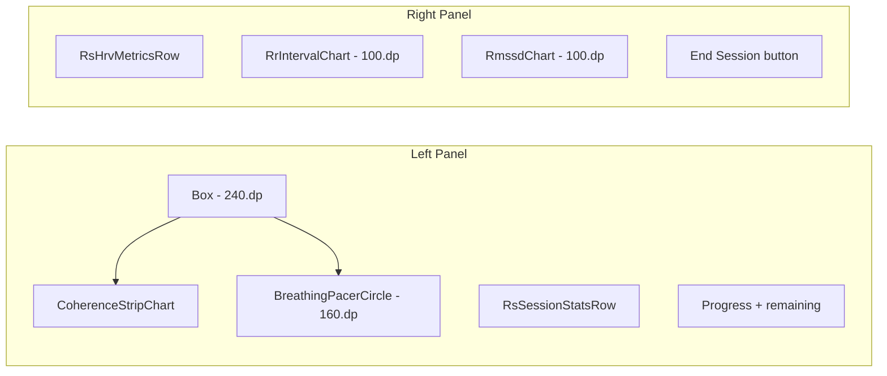

# Resonance Session Screen Enhancements

**Date:** 2026-05-18  
**Location:** [`ResonanceSessionScreen.kt`](app/src/main/java/com/example/wags/ui/breathing/ResonanceSessionScreen.kt) → `ResonanceSessionScreen`

## Problem Statement

Three enhancements requested for the Resonance Session active breathing screen:

1. **Color mode for inhale/exhale** — The current greyscale pacer (`PacerInhale` = light grey, `PacerExhale` = dark grey) is too subtle for peripheral vision detection. Users want an optional vivid color mode so they can see the breath phase switch without looking directly at the circle.
2. **Coherence chart behind the pacer** — The coherence score chart should scroll behind the inhale/exhale circle as a background layer, creating a more immersive visual experience.
3. **Landscape layout** — The current single-column vertical scroll wastes horizontal space in landscape. Need a side-by-side layout.

---

## Current Architecture

### Layout (Portrait, BREATHING phase)

```
Column (verticalScroll)
  ├── BreathingPacerCircle (200.dp)
  ├── RsSessionStatsRow (BPM / TIME / COHERENCE)
  ├── LinearProgressIndicator + remaining time
  ├── RsHrvMetricsRow (HR / RMSSD / SDNN / BEATS)
  ├── RsChartLabel "RR INTERVAL"
  ├── RrIntervalChart (100.dp)
  ├── RsChartLabel "RMSSD"
  ├── RmssdChart (100.dp)
  └── OutlinedButton "End Session"
```

### Key Files

| File | Role |
|------|------|
| [`ResonanceSessionScreen.kt`](app/src/main/java/com/example/wags/ui/breathing/ResonanceSessionScreen.kt) | Main screen composable |
| [`BreathingPacerCircle.kt`](app/src/main/java/com/example/wags/ui/breathing/BreathingPacerCircle.kt) | Animated inhale/exhale circle |
| [`BreathingViewModel.kt`](app/src/main/java/com/example/wags/ui/breathing/BreathingViewModel.kt) | ViewModel exposing `coherenceHistory: List<Float>` |
| [`RrStripChart.kt`](app/src/main/java/com/example/wags/ui/common/RrStripChart.kt) | Shared strip-chart engine |
| [`Color.kt`](app/src/main/java/com/example/wags/ui/theme/Color.kt) | Theme colors including `PacerInhale` / `PacerExhale` |

### Existing Patterns

- **Landscape detection:** Other history screens use `LocalConfiguration.current` and `screenWidthDp > screenHeightDp` — see [`RfAssessmentHistoryScreen.kt`](app/src/main/java/com/example/wags/ui/breathing/RfAssessmentHistoryScreen.kt:175)
- **Preference persistence:** Vibration toggle uses `SharedPreferences` — see [`BreathingScreen.kt`](app/src/main/java/com/example/wags/ui/breathing/BreathingScreen.kt:90)
- **Strip chart:** [`RrStripChart.kt`](app/src/main/java/com/example/wags/ui/common/RrStripChart.kt) provides `RrStripChartState`, `StripChartColors`, and `Canvas`-based rendering at 60fps

---

## Proposed Changes

### Enhancement 1: Color Mode for Inhale/Exhale

**Goal:** Add a toggle that switches the pacer circle from greyscale to vivid colors, making the phase transition visible in peripheral vision.

**Color palette for vivid mode:**

| Phase | Greyscale (current) | Vivid (new) |
|-------|---------------------|-------------|
| Inhale | `PacerInhale` #D0D0D0 light grey | `PacerInhaleVivid` #4FC3F7 light blue |
| Exhale | `PacerExhale` #606060 dark grey | `PacerExhaleVivid` #FF8A65 warm amber |
| Peak flash | White | White (unchanged) |

The blue/amber pair was chosen because:
- Strong hue contrast (cool vs warm) — instantly distinguishable peripherally
- Both colors maintain sufficient brightness on the dark background
- Color-blind safe (blue/orange is the most common deuteranopia-safe pair)

**Changes:**

1. **[`Color.kt`](app/src/main/java/com/example/wags/ui/theme/Color.kt)** — Add two new color constants:
   ```kotlin
   val PacerInhaleVivid = Color(0xFF4FC3F7)   // light blue
   val PacerExhaleVivid = Color(0xFFFF8A65)   // warm amber
   ```

2. **[`BreathingPacerCircle.kt`](app/src/main/java/com/example/wags/ui/breathing/BreathingPacerCircle.kt)** — Add `colorMode: Boolean = false` parameter. When `true`, use vivid colors instead of greyscale:
   ```kotlin
   val inhaleColor = if (colorMode) PacerInhaleVivid else PacerInhale
   val exhaleColor = if (colorMode) PacerExhaleVivid else PacerExhale
   
   val baseColor = when {
       isAtPeak    -> Color.White
       isInhaling  -> inhaleColor
       else        -> exhaleColor
   }
   ```

3. **[`ResonanceSessionScreen.kt`](app/src/main/java/com/example/wags/ui/breathing/ResonanceSessionScreen.kt)** — Add color mode toggle:
   - Read/write `breathing_color_mode` from `SharedPreferences` (same `apnea_prefs` store already used)
   - Add a small toggle icon button in the top bar actions or near the pacer
   - Pass `colorMode` to `BreathingPacerCircle`

---

### Enhancement 2: Coherence Chart Scrolling Behind the Pacer

**Goal:** Replace the flat background behind the pacer circle with a scrolling coherence ratio strip chart, so the user sees their coherence trend in context while breathing.

**Approach:** Create a new `CoherenceStripChart` composable that reuses the same `RrStripChartState` / `Canvas` pattern from [`RrStripChart.kt`](app/src/main/java/com/example/wags/ui/common/RrStripChart.kt), but plots `coherenceHistory` values instead of RR intervals.

**Layout change (portrait BREATHING phase):**

```
Box (full width, ~280.dp tall)
  ├── CoherenceStripChart (fills box, z=0)     ← NEW: scrolling coherence background
  ├── BreathingPacerCircle (centered, z=1)     ← overlaid on top
  └── RsSessionStatsRow (bottom-aligned, z=1)  ← overlaid at bottom
```

**Changes:**

1. **New file: [`CoherenceStripChart.kt`](app/src/main/java/com/example/wags/ui/common/CoherenceStripChart.kt)** — A lightweight strip chart for coherence ratio values:
   - Accepts `values: List<Float>` and `windowMs: Double`
   - Uses the same `Canvas` + `withFrameNanos` approach as `RrIntervalChart`
   - Draws zone threshold lines at ratio = 1.0 (medium) and 3.0 (high)
   - Colors dots by coherence zone (same grey/red/blue/green as existing)
   - Line color: `EcgCyan` (light grey) to match existing palette
   - Semi-transparent background so the pacer circle remains clearly visible on top

2. **[`BreathingViewModel.kt`](app/src/main/java/com/example/wags/ui/breathing/BreathingViewModel.kt)** — The `coherenceHistory: List<Float>` is already tracked and updated every 5 seconds. No ViewModel changes needed, but we need to ensure the chart can consume this list efficiently. The existing list grows unbounded during a session; for the strip chart we only need the last N samples that fit the window. The chart composable will handle windowing internally (same pattern as `RrIntervalChart`).

3. **[`ResonanceSessionScreen.kt`](app/src/main/java/com/example/wags/ui/breathing/ResonanceSessionScreen.kt)** — Replace the standalone `BreathingPacerCircle` + `RsSessionStatsRow` block with a `Box` overlay:
   ```kotlin
   Box(
       modifier = Modifier.fillMaxWidth().height(280.dp),
       contentAlignment = Alignment.Center
   ) {
       // Background layer: scrolling coherence chart
       CoherenceStripChart(
           values = state.coherenceHistory,
           windowMs = COHERENCE_CHART_WINDOW_MS,
           modifier = Modifier.fillMaxSize()
       )
       // Foreground layer: pacer circle
       BreathingPacerCircle(
           progress = state.pacerRadius,
           isInhaling = state.isInhaling,
           colorMode = colorModeEnabled,
           size = 200.dp,
           onPhaseTransition = vibrationCallback
       )
       // Stats row at bottom
       RsSessionStatsRow(
           breathingRateBpm = state.breathingRateBpm,
           elapsedSeconds = state.sessionElapsedSeconds,
           coherenceRatio = state.liveCoherenceRatio,
           modifier = Modifier.align(Alignment.BottomCenter)
       )
   }
   ```

---

### Enhancement 3: Landscape Layout

**Goal:** Use a side-by-side layout in landscape so the pacer+chart and the data panels are both visible without scrolling.

**Layout (Landscape BREATHING phase):**

```
Row (fillMaxSize)
  ├── Column (weight 1f, verticalScroll) — Left panel
  │     ├── Box: CoherenceStripChart + BreathingPacerCircle overlay
  │     ├── RsSessionStatsRow
  │     └── LinearProgressIndicator + remaining time
  └── Column (weight 1f, verticalScroll) — Right panel
        ├── RsHrvMetricsRow
        ├── RrIntervalChart (100.dp)
        ├── RmssdChart (100.dp)
        └── OutlinedButton "End Session"
```

**Changes:**

1. **[`ResonanceSessionScreen.kt`](app/src/main/java/com/example/wags/ui/breathing/ResonanceSessionScreen.kt)** — Add landscape detection and conditional layout:
   ```kotlin
   val configuration = LocalConfiguration.current
   val isLandscape = configuration.screenWidthDp > configuration.screenHeightDp
   
   // In BREATHING phase:
   if (isLandscape) {
       Row(modifier = Modifier.fillMaxSize()) {
           // Left: pacer + chart + stats
           Column(weight = 1f, verticalScroll, horizontalAlignment = CenterHorizontally) { ... }
           // Right: metrics + charts + button
           Column(weight = 1f, verticalScroll, horizontalAlignment = CenterHorizontally) { ... }
       }
   } else {
       // Existing portrait Column layout (with Box overlay for coherence chart)
   }
   ```

2. **Pacer size adjustment** — In landscape, reduce pacer circle from `200.dp` to `160.dp` so it fits comfortably in the left panel alongside the coherence chart background.

3. **Chart heights** — In landscape, the RR/RMSSD charts can stay at `100.dp` since they have the full right column width. The coherence chart background height should be `240.dp` in landscape (vs `280.dp` portrait).

---

## Mermaid: Proposed BREATHING Phase Layout

### Portrait

```mermaid
graph TD
    A[Box - 280.dp tall] --> B[CoherenceStripChart - background layer]
    A --> C[BreathingPacerCircle - centered overlay]
    A --> D[RsSessionStatsRow - bottom overlay]
    E[LinearProgressIndicator + remaining]
    F[RsHrvMetricsRow]
    G[RrIntervalChart - 100.dp]
    H[RmssdChart - 100.dp]
    I[OutlinedButton - End Session]
    
    style B fill:#1a1a2e,stroke:#444
    style C fill:#2a2a4a,stroke:#666
```



### Landscape



---

## File Change Summary

| File | Change Type | Description |
|------|-------------|-------------|
| [`Color.kt`](app/src/main/java/com/example/wags/ui/theme/Color.kt) | Modify | Add `PacerInhaleVivid` and `PacerExhaleVivid` color constants |
| [`BreathingPacerCircle.kt`](app/src/main/java/com/example/wags/ui/breathing/BreathingPacerCircle.kt) | Modify | Add `colorMode: Boolean = false` param; use vivid colors when enabled |
| [`CoherenceStripChart.kt`](app/src/main/java/com/example/wags/ui/common/CoherenceStripChart.kt) | **New** | Scrolling strip chart for coherence ratio values |
| [`ResonanceSessionScreen.kt`](app/src/main/java/com/example/wags/ui/breathing/ResonanceSessionScreen.kt) | Modify | Add color mode toggle + persistence; Box overlay for chart behind pacer; landscape Row layout |
| [`README.md`](README.md) | Modify | Document new features |

**No ViewModel changes needed** — `coherenceHistory: List<Float>` is already exposed in `BreathingUiState`.

---

## Implementation Order

1. Add vivid color constants to `Color.kt`
2. Add `colorMode` parameter to `BreathingPacerCircle`
3. Create `CoherenceStripChart.kt` composable
4. Refactor `ResonanceSessionScreen` BREATHING phase: Box overlay with chart behind pacer
5. Add color mode toggle + SharedPreferences persistence to `ResonanceSessionScreen`
6. Add landscape-aware layout to `ResonanceSessionScreen`
7. Update `README.md`
