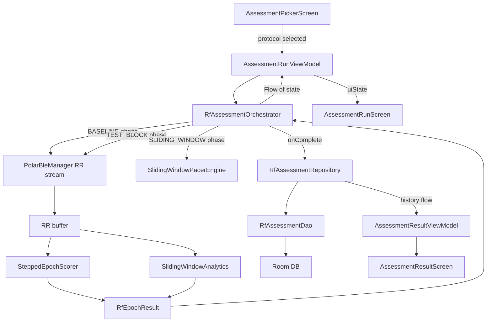

# RF Assessment Expansion Plan
_Created: 2026-03-11_

## Overview

The current Android app has a single RF assessment type (`EXPRESS` stepped protocol) surfaced in `BreathingScreen`. The desktop hrvm app has a much richer ecosystem: four stepped protocols, a continuous sliding-window protocol, a targeted micro-adjustment protocol, and a manual breathing mode with a leaderboard and session history. This plan ports and expands that full ecosystem to Android.

---

## What Exists Today (Android)

| Layer | File | What it does |
|---|---|---|
| Orchestrator | [`RfAssessmentOrchestrator.kt`](app/src/main/java/com/example/wags/domain/usecase/breathing/RfAssessmentOrchestrator.kt) | Runs stepped protocols (EXPRESS/STANDARD/DEEP/TARGETED/CONTINUOUS) as a coroutine countdown. Epoch results are placeholders — no real HRV math is wired in. |
| Math | [`CoherenceScoreCalculator.kt`](app/src/main/java/com/example/wags/domain/usecase/breathing/CoherenceScoreCalculator.kt) | FFT coherence score + phase synchrony + PT amplitude. All the math is there. |
| Pacer | [`ContinuousPacerEngine.kt`](app/src/main/java/com/example/wags/domain/usecase/breathing/ContinuousPacerEngine.kt) | Fixed-rate pacer. Does NOT implement the analytically-integrated sliding-frequency wave needed for the continuous protocol. |
| ViewModel | [`BreathingViewModel.kt`](app/src/main/java/com/example/wags/ui/breathing/BreathingViewModel.kt) | Starts only `EXPRESS` protocol. Epoch results are never computed with real data. |
| UI | [`BreathingScreen.kt`](app/src/main/java/com/example/wags/ui/breathing/BreathingScreen.kt) | Shows pacer circle + coherence score + one "Start RF Assessment" button. No protocol picker, no leaderboard, no history. |
| DB | [`RfAssessmentEntity.kt`](app/src/main/java/com/example/wags/data/db/entity/RfAssessmentEntity.kt) | Stores one row per session (best result + leaderboard JSON). |

**Key gaps:**
1. Epoch math is never actually called — orchestrator emits placeholder `RfEpochResult` with all zeros.
2. No continuous sliding-window pacer (the desktop `ContinuousPacer` class).
3. No continuous sliding-window analytics (wavelet LF power + Hilbert PLV).
4. No protocol picker in the UI.
5. No leaderboard UI.
6. No session history UI.
7. No "Targeted" protocol (requires reading historical optimal from DB).
8. No quality-gate feedback shown to user.

---

## What the Desktop Has (hrvm)

### Protocols
| Key | Type | Duration | Grid |
|---|---|---|---|
| Express Sweep | stepped | ~8 min | 5 rates × 1 min test + 30 s washout |
| Standard Sweep | stepped | ~18 min | 5 rates × 2 min test + 60 s washout |
| Deep Calibration | stepped | ~42 min | 13 rate+ratio combos × 3 min test |
| Targeted Micro-Adjustment | stepped | ~10 min | optimal ± 0.2 BPM × 3 min (requires history) |
| Quick Scan Sliding Window | continuous | ~16 min | analytically-integrated chirp 6.75→4.5 BPM |

### Scoring (stepped)
`score = phase×0.40 + (PT/baseline_PT)×0.30 + (LFnu/100)×0.20 + (RMSSD/baseline_RMSSD)×0.10`  
Quality gates: `phase >= 0.25` AND `pt_amp >= 1.5 BPM`

### Scoring (continuous)
Resonance index = `0.4×norm(LF_power) + 0.4×norm(PT_amp) + 0.2×norm(PLV)`  
Quality gates: `peak_PLV >= 0.3` AND `peak / mean >= 1.5`

### Leaderboard
- Two sub-leaderboards: "Prescribed Rate" vs "ACC Breathing"
- Ranked by composite score
- Invalid epochs shown with ⚠ marker in amber

### Session History
- Flat table of all epochs across all sessions
- Filterable by source (Prescribed / ACC)
- Sortable by any column

---

## Target Architecture

### New Files to Create

```
domain/usecase/breathing/
  SlidingWindowPacerEngine.kt       ← port of ContinuousPacer from hrvm
  SlidingWindowAnalytics.kt         ← port of ContinuousSlidingMath (LF wavelet + Hilbert PLV)
  SteppedEpochScorer.kt             ← port of PhysiologicalMath.score_epoch()
  RfAssessmentRepository.kt        ← reads/writes RfAssessmentEntity, exposes history

ui/breathing/
  AssessmentPickerScreen.kt         ← new screen: protocol picker + start button
  AssessmentPickerViewModel.kt
  AssessmentRunScreen.kt            ← new screen: live pacer + HUD during assessment
  AssessmentRunViewModel.kt
  AssessmentResultScreen.kt         ← new screen: leaderboard + history tabs
  AssessmentResultViewModel.kt
```

### Modified Files

```
domain/usecase/breathing/
  RfAssessmentOrchestrator.kt       ← wire real epoch math, add SLIDING_WINDOW protocol type

ui/breathing/
  BreathingScreen.kt                ← replace inline RF section with nav button → AssessmentPickerScreen

ui/navigation/
  WagsNavGraph.kt                   ← add 3 new routes

data/db/entity/
  RfAssessmentEntity.kt             ← add accBreathingUsed: Boolean column

data/db/
  WagsDatabase.kt                   ← bump version to 5, add migration
```

---

## Detailed Design

### 1. `SlidingWindowPacerEngine.kt`

Port of the desktop `ContinuousPacer`. Analytically integrates phase across a chirp from 6.75 BPM down to ~4.5 BPM over 78 breath cycles (~16 min).

```kotlin
// Key fields
val totalBreaths = 78
val startBpm = 6.75f
val deltaT = 0.06704f  // seconds per cycle added each breath

// evaluate(elapsedSeconds): returns (instantBpm, phaseRadians, refWave 0-1)
```

This is needed because the existing `ContinuousPacerEngine` only supports a fixed rate — it cannot produce the chirp waveform.

### 2. `SlidingWindowAnalytics.kt`

Port of `ContinuousSlidingMath`. Runs after the continuous protocol completes on the collected RR buffer.

```kotlin
// computeContinuousLfPower(timeRr, rrMs): resamples to 4 Hz, CWT with Morlet wavelet
// calculateRollingMetrics(rrResampled, refWave): rolling PT amplitude + Hilbert PLV
// extractResonanceFrequency(timeGrid, lfPower, ptAmp, plv, pacingBpm): quality gates + peak detection
```

**Note on wavelet:** The desktop uses `pywt.cwt` with `cmor1.5-1.0`. On Android we will use Apache Commons Math's `FastFourierTransformer` for a simpler CWT approximation, or use a bandpass-filtered Hilbert approach (already partially available via `FftProcessor` + `PsdBandIntegrator`). The exact implementation can use a sliding 60-second FFT window instead of a full CWT — this is simpler and sufficient for mobile.

### 3. `SteppedEpochScorer.kt`

Thin wrapper that calls existing `CoherenceScoreCalculator` methods and applies the composite formula:

```kotlin
fun score(
    rmssd: Float, ptAmp: Float, lfNu: Float, phaseSynchrony: Float,
    baselineRmssd: Float, baselinePtAmp: Float
): Pair<Float, Boolean>  // (score 0-260+, isValid)
```

Quality gates: `phaseSynchrony >= 0.25f && ptAmp >= 1.5f`

### 4. `RfAssessmentOrchestrator.kt` (modified)

Add `SLIDING_WINDOW` to `RfProtocol` enum. Wire real math:

- During `BASELINE` phase: collect RR intervals, compute baseline RMSSD + LF power at end.
- During `TEST_BLOCK` phase: collect RR intervals, compute epoch metrics at end using `SteppedEpochScorer`.
- During `SLIDING_WINDOW` phase: use `SlidingWindowPacerEngine` for the pacer, collect all RR, run `SlidingWindowAnalytics` at end.

The orchestrator exposes a `Flow<RfOrchestratorState>` that the ViewModel collects.

### 5. Navigation & Screens

Replace the inline `RfAssessmentSection` in `BreathingScreen` with a single "Run RF Assessment" button that navigates to `AssessmentPickerScreen`.

**Route structure:**
```
breathing                    (existing)
  └─ rf_assessment_picker    (new) — protocol picker
       └─ rf_assessment_run  (new) — live pacer + HUD
            └─ rf_assessment_result  (new) — leaderboard + history
```

#### `AssessmentPickerScreen`
- Protocol dropdown (Express / Standard / Deep / Targeted / Sliding Window)
- "Targeted" shows disabled with tooltip if no history exists
- Description card for selected protocol (duration, what it measures)
- "Start Assessment" button → navigates to `AssessmentRunScreen`

#### `AssessmentRunScreen`
- Animated breathing pacer (circle for stepped, horizontal bar for sliding window)
- HUD: current phase label, time remaining, current rate BPM
- Progress bar (total session progress)
- Status text (BASELINE / TESTING X.X BPM / WASHOUT / COMPLETE)
- Quality gate warning if epoch is flagged invalid
- Cancel button

#### `AssessmentResultScreen`
- Tab bar: "Leaderboard" | "History"
- **Leaderboard tab:** ranked list of epochs from this session, score color-coded (Red→Orange→Green→Blue→Pink→Yellow→White per desktop scale), ⚠ on invalid epochs
- **History tab:** all past sessions, filterable by source, sortable by column
- "Best result" banner at top (optimal BPM + score)
- "Run Again" button

### 6. Database Migration (v4 → v5)

Add `accBreathingUsed INTEGER NOT NULL DEFAULT 0` to `rf_assessments` table.

```kotlin
val MIGRATION_4_5 = object : Migration(4, 5) {
    override fun migrate(db: SupportSQLiteDatabase) {
        db.execSQL("ALTER TABLE rf_assessments ADD COLUMN accBreathingUsed INTEGER NOT NULL DEFAULT 0")
    }
}
```

---

## Data Flow Diagram



---

## Protocol Definitions (Kotlin)

```kotlin
enum class RfProtocol {
    EXPRESS,          // 5 rates x 1 min, 30s washout  (~8 min)
    STANDARD,         // 5 rates x 2 min, 60s washout  (~18 min)
    DEEP,             // 13 combos x 3 min, 60s washout (~42 min)
    TARGETED,         // optimal+-0.2 x 3 min, 60s washout (~10 min, needs history)
    SLIDING_WINDOW    // chirp 6.75->4.5 BPM, ~16 min continuous
}

// Stepped grid for DEEP (rate BPM, ie ratio)
val DEEP_GRID = listOf(
    6.5f to 1.0f, 6.5f to 1.5f,
    6.0f to 1.0f, 6.0f to 1.5f, 6.0f to 2.0f,
    5.5f to 1.0f, 5.5f to 1.5f, 5.5f to 2.0f,
    5.0f to 1.0f, 5.0f to 1.5f, 5.0f to 2.0f,
    4.5f to 1.0f, 4.5f to 1.5f
)
```

---

## Score Color Scale (from desktop)

| Score | Color | Label |
|---|---|---|
| 0–80 | Red | Low |
| 80–130 | Orange | Fair |
| 130–170 | Green | Good |
| 170–210 | Blue | Very Good |
| 210–230 | Pink | Excellent |
| 230–245 | Yellow | Exceptional |
| 245+ | White | Extraordinary |

---

## File-by-File Implementation Order

1. **`SteppedEpochScorer.kt`** — pure math, no dependencies, easy to write first
2. **`SlidingWindowPacerEngine.kt`** — pure math, port of `ContinuousPacer`
3. **`SlidingWindowAnalytics.kt`** — pure math, port of `ContinuousSlidingMath`
4. **`RfAssessmentOrchestrator.kt`** (modify) — wire real math into existing orchestrator, add `SLIDING_WINDOW`
5. **`RfAssessmentEntity.kt`** (modify) + **`WagsDatabase.kt`** (migration v4→v5)
6. **`RfAssessmentRepository.kt`** — new repository wrapping the DAO
7. **`AssessmentPickerScreen.kt`** + **`AssessmentPickerViewModel.kt`**
8. **`AssessmentRunScreen.kt`** + **`AssessmentRunViewModel.kt`**
9. **`AssessmentResultScreen.kt`** + **`AssessmentResultViewModel.kt`**
10. **`WagsNavGraph.kt`** (modify) — add 3 new routes
11. **`BreathingScreen.kt`** (modify) — replace inline RF section with nav button
12. **`DatabaseModule.kt`** / **`AppModule.kt`** — inject new repository
