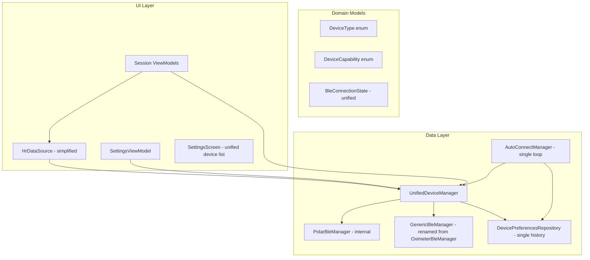
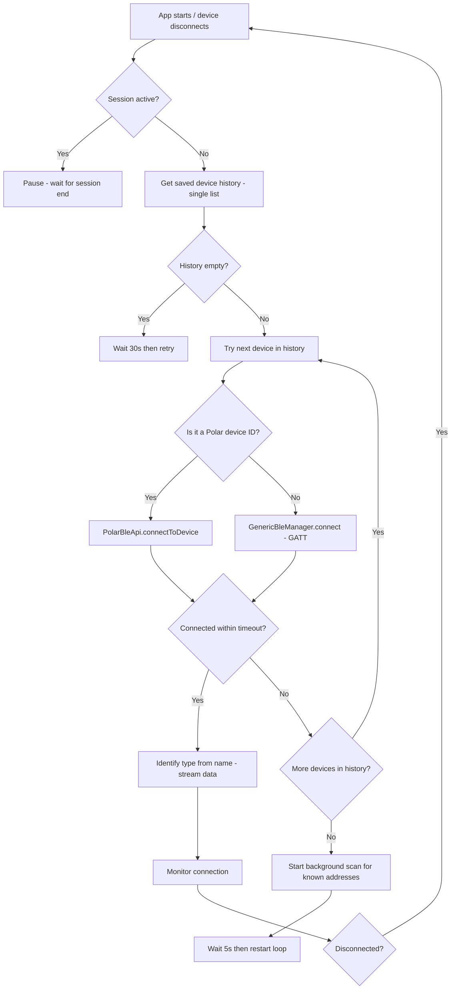

# Unified BLE Device Architecture Plan

**Created:** 2026-03-23  
**Status:** Draft — awaiting approval

## Problem Statement

The app currently treats BLE devices as belonging to one of two predetermined categories: **Polar** (managed by `PolarBleManager` via the Polar SDK) and **Oximeter** (managed by `OximeterBleManager` via raw Android BLE GATT). This causes:

1. Devices being misclassified (e.g., Polar H10 ending up in the oximeter slot)
2. Two completely separate scan/connect/reconnect subsystems that duplicate logic
3. Rigid "Polar Devices" vs "Oximeter / SpO₂ Devices" sections in the Settings UI
4. Every ViewModel needing to inject both managers and manually merge their state

## Design Principles

1. **Any BLE device can be scanned and connected** — no predetermined categories
2. **Device type is recognized by name after connection** — not by which manager handles it
3. **Capabilities are derived from device type** — HR, RR, ECG, ACC, SpO₂, etc.
4. **Single device history** — one ordered list of previously-connected devices
5. **Auto-reconnect cycles through history** — stops on first success, resumes on disconnect

## Key Constraint: Polar SDK

The Polar SDK (`PolarBleApi`) is a third-party library that handles its own BLE scanning and GATT connections internally. We **cannot** replace it with raw Android BLE for Polar devices — the SDK is required for HR streaming, RR intervals, ECG, ACC, and PPI.

**This means we must keep two connection backends** but present them as a unified interface:
- Polar devices → `PolarBleApi` (SDK handles GATT internally)
- Non-Polar devices → Raw Android BLE GATT (our `OximeterBleManager` logic)

The key change is that the **consumer-facing API is unified** — ViewModels and UI only see a single `DeviceType` + `BleConnectionState`, never "PolarBleManager" vs "OximeterBleManager".

## Architecture Overview

## Device Type Recognition

| Name Pattern | DeviceType | Capabilities |
|---|---|---|
| Contains "H10" | `POLAR_H10` | HR, RR, ECG, ACC |
| Contains "Sense" | `POLAR_VERITY` | HR, PPI |
| Contains "OxySmart" or other known oximeter names | `OXIMETER` | HR, SPO2 |
| Any other | `GENERIC_BLE` | HR (best effort) |

Recognition happens **after connection** when the device name is known. During scanning, devices are shown by their advertised name without categorization.

## Session → Device Requirements

| Session Type | Required Device | Required Capabilities |
|---|---|---|
| Morning Readiness | Polar H10 | ACC (for stand detection) |
| HRV Readiness | Any HR device | HR, RR |
| Breathing / RF Assessment | Any HR device | HR, RR |
| Meditation | Any HR device | HR (RR preferred) |
| Apnea (free hold) | Any HR device | HR (SpO₂ optional from oximeter) |
| Apnea (table training) | Any HR device | HR |

## Auto-Reconnect Strategy

**Key difference from current:** One loop, one history list. No separate Polar loop + Oximeter loop.

## Implementation Phases

### Phase 1: New Domain Models

**Files to create:**
- `domain/model/DeviceType.kt` — enum with `POLAR_H10`, `POLAR_VERITY`, `OXIMETER`, `GENERIC_BLE`
- `domain/model/DeviceCapability.kt` — enum with `HR`, `RR`, `ECG`, `ACC`, `PPI`, `SPO2`

**Files to modify:**
- `domain/model/BleConnectionState.kt` — add `deviceType: DeviceType` to `Connected` state

### Phase 2: Unified DevicePreferencesRepository

**File:** `data/ble/DevicePreferencesRepository.kt`

- Add a single `KEY_DEVICE_HISTORY` list that stores all devices (Polar IDs + BLE MAC addresses)
- Each entry stores: `identifier|name|isPolar` (pipe-separated)
- Migration: merge existing `polarHistory` + `oximeterHistory` into unified list
- Keep legacy accessors temporarily for backward compatibility during migration

### Phase 3: Refactor PolarBleManager

**File:** `data/ble/PolarBleManager.kt`

- Remove `h10State` / `verityState` dual-slot system
- Single `connectionState: StateFlow<BleConnectionState>` 
- Keep `DeviceType` detection from name (H10 vs Verity) but expose it via `BleConnectionState.Connected.deviceType`
- Keep all stream methods (HR, RR, ECG, ACC, PPI) — they are device-specific but the manager doesn't need slots

### Phase 4: Rename + Refactor OximeterBleManager → GenericBleManager

**File:** `data/ble/OximeterBleManager.kt` → `data/ble/GenericBleManager.kt`

- Remove the Polar-exclusion filter from scan results (show ALL devices)
- Use unified `BleConnectionState` instead of `OximeterConnectionState`
- Keep the GATT connection logic, NUS protocol parsing, SpO₂/HR data extraction
- Detect `DeviceType` from name after connection

### Phase 5: Create UnifiedDeviceManager

**New file:** `data/ble/UnifiedDeviceManager.kt`

- Facade that wraps `PolarBleManager` + `GenericBleManager`
- Exposes single `connectionState: StateFlow<BleConnectionState>`
- `connect(identifier)` — routes to Polar SDK or Generic GATT based on device history metadata
- `disconnect()`
- `startScan()` / `stopScan()` — runs both scans, merges results into single list
- `scanResults: StateFlow<List<ScannedDevice>>` — unified scan result model

### Phase 6: Simplify HrDataSource

**File:** `data/ble/HrDataSource.kt`

- Inject `UnifiedDeviceManager` instead of both managers
- `liveHr` comes from whichever device is connected
- `liveSpO2` comes from connected device if it has `SPO2` capability
- Remove `isOximeterPrimaryDevice()` — replaced by checking `connectedDevice.type.capabilities.contains(SPO2)`
- `isAnyHrDeviceConnected` simplified to single state check

### Phase 7: Refactor AutoConnectManager

**File:** `data/ble/AutoConnectManager.kt`

- Single loop iterating through unified device history
- For each device: check if it's a Polar ID or BLE MAC, route to appropriate backend
- Stop on first successful connection
- On disconnect: restart the loop
- Background scan: scan for ALL known addresses (not just oximeter)

### Phase 8: Update BleService + BleModule DI

**Files:** `data/ble/BleService.kt`, `di/BleModule.kt`

- `BleService` injects `UnifiedDeviceManager` instead of `PolarBleManager`
- `BleModule` provides `UnifiedDeviceManager` as singleton
- Keep `PolarBleApi` provider (still needed internally)

### Phase 9: Update SettingsViewModel + SettingsScreen

**Files:** `ui/settings/SettingsViewModel.kt`, `ui/settings/SettingsScreen.kt`

- Remove `oximeterState`, `oximeterScanResults` from `SettingsUiState`
- Single `deviceState: BleConnectionState` and `scanResults: List<ScannedDevice>`
- Single "Nearby Devices" section (no Polar vs Oximeter split)
- Single `connectDevice(identifier)` / `disconnectDevice()` actions
- `ConnectedDevicesCard` shows one connected device with its detected type

### Phase 10: Update Session ViewModels

**Files:** All ViewModels that inject `PolarBleManager` and/or `OximeterBleManager`

- Replace with `UnifiedDeviceManager` (or just `HrDataSource` where only HR is needed)
- Remove all `oximeterBleManager` references
- Remove `oximeterIsPrimary` / `oximeterSamples` logic — replace with capability checks
- For SpO₂ data: check if connected device has `SPO2` capability

**Affected ViewModels:**
- `SessionViewModel` — uses PolarBleManager + OximeterBleManager
- `ApneaViewModel` — uses PolarBleManager + OximeterBleManager + oximeter samples
- `FreeHoldActiveScreen` (has embedded ViewModel) — same as ApneaViewModel
- `MeditationViewModel` — uses PolarBleManager + OximeterBleManager
- `BreathingViewModel` — uses PolarBleManager only
- `ReadinessViewModel` — uses PolarBleManager only
- `MorningReadinessViewModel` — uses PolarBleManager + `isH10Connected()` check
- `AssessmentRunViewModel` — uses PolarBleManager only

### Phase 11: Cleanup

- Delete `domain/model/OximeterConnectionState.kt`
- Delete `domain/model/OximeterReading.kt` (or keep if SpO₂ data model is still useful)
- Update `README.md` with new architecture description

## Files Affected Summary

| File | Action |
|---|---|
| `domain/model/DeviceType.kt` | **CREATE** |
| `domain/model/DeviceCapability.kt` | **CREATE** |
| `domain/model/BleConnectionState.kt` | MODIFY — add deviceType |
| `domain/model/OximeterConnectionState.kt` | DELETE |
| `data/ble/UnifiedDeviceManager.kt` | **CREATE** |
| `data/ble/PolarBleManager.kt` | MODIFY — remove dual slots |
| `data/ble/OximeterBleManager.kt` | RENAME + MODIFY → GenericBleManager |
| `data/ble/HrDataSource.kt` | MODIFY — use UnifiedDeviceManager |
| `data/ble/AutoConnectManager.kt` | MODIFY — single loop |
| `data/ble/DevicePreferencesRepository.kt` | MODIFY — unified history |
| `data/ble/BleService.kt` | MODIFY — use UnifiedDeviceManager |
| `di/BleModule.kt` | MODIFY — provide UnifiedDeviceManager |
| `ui/settings/SettingsViewModel.kt` | MODIFY — unified state |
| `ui/settings/SettingsScreen.kt` | MODIFY — unified UI |
| `ui/session/SessionViewModel.kt` | MODIFY |
| `ui/apnea/ApneaViewModel.kt` | MODIFY |
| `ui/apnea/FreeHoldActiveScreen.kt` | MODIFY |
| `ui/meditation/MeditationViewModel.kt` | MODIFY |
| `ui/breathing/BreathingViewModel.kt` | MODIFY |
| `ui/readiness/ReadinessViewModel.kt` | MODIFY |
| `ui/morning/MorningReadinessViewModel.kt` | MODIFY |
| `ui/breathing/AssessmentRunViewModel.kt` | MODIFY |

## Risk Mitigation

1. **Backward compatibility:** Migration in `DevicePreferencesRepository` preserves existing saved devices
2. **Polar SDK constraint:** We keep the Polar SDK internally — only the consumer-facing API changes
3. **Incremental approach:** Each phase can be tested independently
4. **SpO₂ data:** `OximeterReading` model can be kept as-is — it's a data model, not a connection model
