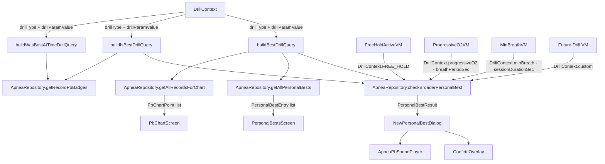

# Universal Trophy System Plan

*Created: 2026-04-09 19:52 UTC-6*

## Problem Statement

The trophy/personal-best system currently works **only for free holds** (`tableType IS NULL`). Every DAO query, repository method, and UI screen is hardcoded to filter on `tableType IS NULL`. We need the same trophy system — celebration dialog, confetti, sounds, Personal Bests screen, PB Chart screen — to work for **any drill type**, with completely separate PB pools per drill-specific parameter.

### Concrete requirements:

| Drill | PB metric | Drill-specific partition key | Meaning |
|---|---|---|---|
| **Free Hold** | `durationMs` (hold time) | *(none — just the 5 apnea settings)* | One PB pool |
| **Progressive O₂** | `durationMs` (longest completed hold) | `breathPeriodSec` (e.g. 30, 60, 90…) | Separate PB pool per breath period |
| **Min Breath** | `holdPct` (% of session spent holding) | `sessionDurationSec` (e.g. 120, 300, 600…) | Separate PB pool per session duration |
| **Future drills** | *(varies)* | *(varies)* | Must be extensible |

Each drill × drill-param combination gets its own **full trophy hierarchy** (6🏆 global down to 1🏆 exact) across the 5 standard apnea settings (lungVolume, prepType, timeOfDay, posture, audio).

---

## Current Architecture (Free Hold Only)

### Data Flow

```
Hold completes → checkBroaderPersonalBest() → PersonalBestResult → NewPersonalBestDialog + confetti + sound
                                                                  ↓
                                              PersonalBestsScreen ← getAllPersonalBests()
                                              PbChartScreen       ← getAllFreeHoldsForChart()
```

### Key Components

| Component | File | What it does |
|---|---|---|
| `ApneaRecordEntity` | `data/db/entity/ApneaRecordEntity.kt` | Stores `durationMs`, 5 settings, `tableType` |
| `ApneaRecordDao` | `data/db/dao/ApneaRecordDao.kt` | `buildBestFreeHoldQuery()`, `buildIsBestQuery()`, `buildWasBestAtTimeQuery()` — all hardcoded to `tableType IS NULL` |
| `ApneaRepository` | `data/repository/ApneaRepository.kt` | `checkBroaderPersonalBest()`, `getAllPersonalBests()`, `getAllFreeHoldsForChart()`, `getRecordPbBadges()`, `getBestRecordTrophyLevel()` — all free-hold only |
| `PersonalBestsViewModel` | `ui/apnea/PersonalBestsViewModel.kt` | Calls `apneaRepository.getAllPersonalBests()` |
| `PersonalBestsScreen` | `ui/apnea/PersonalBestsScreen.kt` | Displays trophy hierarchy, navigates to PbChart |
| `PbChartViewModel` | `ui/apnea/PbChartViewModel.kt` | Calls `apneaRepository.getAllFreeHoldsForChart()` |
| `PbChartScreen` | `ui/apnea/PbChartScreen.kt` | Landscape line chart with zoom/pan |
| `NewPersonalBestDialog` | `ui/apnea/ApneaScreen.kt` | Confetti + sound celebration dialog |
| `ConfettiOverlay` | `ui/apnea/ConfettiOverlay.kt` | Canvas particle system |
| `ApneaPbSoundPlayer` | `ui/apnea/ApneaPbSoundPlayer.kt` | 6 tiered celebration sounds |
| `PersonalBestCategory` | `domain/model/PersonalBestCategory.kt` | Enum + `PersonalBestResult`, `PersonalBestEntry`, `RecordPbBadge` |

### The Core Problem

All SQL queries use `tableType IS NULL` to mean "free hold". The dynamic query builders (`buildBestFreeHoldQuery`, `buildIsBestQuery`, `buildWasBestAtTimeQuery`) have no concept of drill type or drill-specific parameters.

---

## Proposed Solution: `DrillContext` Abstraction

### The Key Insight

Every PB query needs to answer: *"What is the best `metric` among records that match `drillFilter` AND `settingsFilter`?"*

- **drillFilter** = which drill type + which drill-specific parameter value
- **settingsFilter** = which combination of the 5 apnea settings (the trophy hierarchy)
- **metric** = what column to MAX() on (usually `durationMs`, but could be a computed value)

We introduce a simple `DrillContext` data class that encapsulates the drill-specific part of the filter:

```kotlin
/**
 * Identifies a specific PB pool within a drill type.
 *
 * Examples:
 *   DrillContext.FREE_HOLD                          → tableType IS NULL
 *   DrillContext.progressiveO2(breathPeriodSec=60)  → tableType = 'PROGRESSIVE_O2' AND breathPeriodSec = 60
 *   DrillContext.minBreath(sessionDurationSec=300)  → tableType = 'MIN_BREATH' AND sessionDurationSec = 300
 */
data class DrillContext(
    val drillType: String?,           // null = free hold, "PROGRESSIVE_O2", "MIN_BREATH", etc.
    val drillParam: String? = null,   // JSON key name in tableParamsJson (e.g. "breathPeriodSec")
    val drillParamValue: Int? = null,  // The specific value (e.g. 60)
    val metricColumn: String = "durationMs",  // Which column to MAX() for PB comparison
    val displayName: String = "Free Hold"     // Human-readable name for UI
) {
    companion object {
        val FREE_HOLD = DrillContext(drillType = null, displayName = "Free Hold")

        fun progressiveO2(breathPeriodSec: Int) = DrillContext(
            drillType = "PROGRESSIVE_O2",
            drillParam = "breathPeriodSec",
            drillParamValue = breathPeriodSec,
            displayName = "Progressive O₂ (${breathPeriodSec}s breath)"
        )

        fun minBreath(sessionDurationSec: Int) = DrillContext(
            drillType = "MIN_BREATH",
            drillParam = "sessionDurationSec",
            drillParamValue = sessionDurationSec,
            displayName = "Min Breath (${sessionDurationSec / 60}min)"
        )
    }
}
```

### Why This Works

For **free holds**, `drillType = null` maps to `tableType IS NULL` — **identical to current behavior**. Zero regression risk.

For **Progressive O₂ with breathPeriod=60**, the SQL becomes:
```sql
SELECT MAX(r.durationMs) FROM apnea_records r
  INNER JOIN apnea_sessions s ON s.timestamp = r.timestamp AND s.tableType = r.tableType
  WHERE r.tableType = 'PROGRESSIVE_O2'
    AND json_extract(s.tableParamsJson, '$.breathPeriodSec') = 60
    AND r.lungVolume = ? AND r.prepType = ? ...
```

**However**, joining on `tableParamsJson` for every PB query is expensive. A simpler approach: **add a `drillParamValue` column to `ApneaRecordEntity`**.

---

## Detailed Design

### Step 1: Add `drillParamValue` Column to `ApneaRecordEntity`

```kotlin
/** Drill-specific partition value for PB grouping. Null for free holds. */
@ColumnInfo(defaultValue = "NULL")
val drillParamValue: Int? = null
```

This requires a **Room migration** (add column with default NULL). Existing free-hold records get NULL automatically — perfect, since free holds have no drill param.

When saving Progressive O₂ records, set `drillParamValue = breathPeriodSec`.
When saving Min Breath records, set `drillParamValue = sessionDurationSec`.

### Step 2: Generalize the Dynamic Query Builders

Replace the three `buildBestFreeHoldQuery` / `buildIsBestQuery` / `buildWasBestAtTimeQuery` functions with generalized versions that accept a `DrillContext`:

```kotlin
internal fun buildBestDrillQuery(
    drill: DrillContext,
    timeOfDay: String?, lungVolume: String?, prepType: String?,
    posture: String?, audio: String?
): SupportSQLiteQuery {
    val args = mutableListOf<Any>()
    val conditions = mutableListOf<String>()

    // Drill filter
    if (drill.drillType == null) {
        conditions += "tableType IS NULL"
    } else {
        conditions += "tableType = ?"
        args += drill.drillType
        if (drill.drillParamValue != null) {
            conditions += "drillParamValue = ?"
            args += drill.drillParamValue
        }
    }

    // Settings filter (same as before)
    if (timeOfDay  != null) { conditions += "timeOfDay = ?";  args += timeOfDay  }
    if (lungVolume != null) { conditions += "lungVolume = ?"; args += lungVolume }
    if (prepType   != null) { conditions += "prepType = ?";   args += prepType   }
    if (posture    != null) { conditions += "posture = ?";    args += posture    }
    if (audio      != null) { conditions += "audio = ?";      args += audio      }

    val sql = "SELECT MAX(${drill.metricColumn}) FROM apnea_records WHERE ${conditions.joinToString(" AND ")}"
    return SimpleSQLiteQuery(sql, args.toTypedArray())
}
```

Similarly for `buildIsBestDrillQuery` and `buildWasBestAtTimeDrillQuery`.

**The old `buildBestFreeHoldQuery` etc. remain as thin wrappers** calling the new functions with `DrillContext.FREE_HOLD`, so existing callers don't break.

### Step 3: Generalize Repository Methods

Add drill-aware versions of the key repository methods:

```kotlin
// New generalized method
suspend fun checkBroaderPersonalBest(
    drill: DrillContext,
    durationMs: Long,
    lungVolume: String, prepType: String, timeOfDay: String,
    posture: String, audio: String
): PersonalBestResult?

// New generalized method
suspend fun getAllPersonalBests(drill: DrillContext): List<PersonalBestEntry>

// New generalized method
suspend fun getAllRecordsForChart(
    drill: DrillContext,
    lungVolume: String, prepType: String, timeOfDay: String,
    posture: String, audio: String
): List<ApneaRecordEntity>
```

The **existing free-hold methods remain unchanged** as convenience wrappers:
```kotlin
// Existing — unchanged, delegates to new method
suspend fun checkBroaderPersonalBest(
    durationMs: Long, lungVolume: String, prepType: String,
    timeOfDay: String, posture: String, audio: String
): PersonalBestResult? = checkBroaderPersonalBest(
    DrillContext.FREE_HOLD, durationMs, lungVolume, prepType, timeOfDay, posture, audio
)
```

### Step 4: Parameterize PersonalBestsScreen + ViewModel

The `PersonalBestsScreen` and `PersonalBestsViewModel` need to accept a `DrillContext` via navigation arguments:

**Navigation route:**
```
personal_bests?drillType={drillType}&drillParam={drillParam}&drillParamValue={drillParamValue}
```

- Free hold: `personal_bests` (no params — defaults to free hold)
- Progressive O₂ 60s: `personal_bests?drillType=PROGRESSIVE_O2&drillParam=breathPeriodSec&drillParamValue=60`
- Min Breath 300s: `personal_bests?drillType=MIN_BREATH&drillParam=sessionDurationSec&drillParamValue=300`

The ViewModel reconstructs the `DrillContext` from `SavedStateHandle` and passes it to the repository.

### Step 5: Parameterize PbChartScreen + ViewModel

Same pattern — add `drillType`, `drillParam`, `drillParamValue` to the route query params. The ViewModel uses `DrillContext` to call the generalized chart query.

### Step 6: Wire PB Celebration into Drill ViewModels

In `ProgressiveO2ViewModel.saveSession()` and `MinBreathViewModel.saveSession()`, add the PB check **before** saving:

```kotlin
// In ProgressiveO2ViewModel.saveSession():
val drill = DrillContext.progressiveO2(breathPeriodSec)
val pbResult = apneaRepository.checkBroaderPersonalBest(
    drill, longestCompletedHoldMs, lungVolume, prepType, timeOfDay, posture, audio
)
// ... save record ...
if (pbResult != null) {
    _uiState.update { it.copy(newPersonalBest = pbResult) }
}
```

Then in the active screens, show `NewPersonalBestDialog` when `state.newPersonalBest != null` — **reusing the exact same composable** that free holds use.

### Step 7: Add "Personal Bests" Button to Drill Setup Screens

On `ProgressiveO2Screen` and `MinBreathScreen`, add a "🏆 Personal Bests" button that navigates to:
```
personal_bests?drillType=PROGRESSIVE_O2&drillParam=breathPeriodSec&drillParamValue={currentBreathPeriod}
```

---

## What Changes vs. What Stays the Same

### Unchanged (zero regression risk)
- `ConfettiOverlay.kt` — pure UI, no data dependency
- `ApneaPbSoundPlayer.kt` — pure UI, no data dependency  
- `NewPersonalBestDialog` in `ApneaScreen.kt` — already parameterized by `PersonalBestResult`
- `PersonalBestCategory.kt` — enum + data classes are drill-agnostic
- `ApneaRecordEntity` fields — only adding one new nullable column
- All existing free-hold PB behavior — old methods become thin wrappers

### Modified
| File | Change |
|---|---|
| `ApneaRecordEntity.kt` | Add `drillParamValue: Int?` column |
| `WagsDatabase.kt` | Add migration (add column) |
| `ApneaRecordDao.kt` | Add `buildBestDrillQuery()`, `buildIsBestDrillQuery()`, `buildWasBestAtTimeDrillQuery()` generalized builders. Keep old builders as wrappers. |
| `ApneaRepository.kt` | Add drill-aware overloads of `checkBroaderPersonalBest()`, `getAllPersonalBests()`, `getAllRecordsForChart()`, `getRecordPbBadges()`. Keep old methods as wrappers. |
| `PersonalBestsViewModel.kt` | Read `DrillContext` from `SavedStateHandle`, pass to repository |
| `PersonalBestsScreen.kt` | Show drill name in title bar when not free hold |
| `PbChartViewModel.kt` | Read `DrillContext` from `SavedStateHandle`, pass to repository |
| `WagsNavGraph.kt` | Update `PERSONAL_BESTS` and `PB_CHART` routes with optional drill params |
| `ProgressiveO2ViewModel.kt` | Set `drillParamValue` on record save, add PB check + `newPersonalBest` state |
| `ProgressiveO2ActiveScreen.kt` | Show `NewPersonalBestDialog` on PB |
| `ProgressiveO2Screen.kt` | Add "🏆 Personal Bests" button |
| `MinBreathViewModel.kt` | Set `drillParamValue` on record save, add PB check + `newPersonalBest` state |
| `MinBreathActiveScreen.kt` | Show `NewPersonalBestDialog` on PB |
| `MinBreathScreen.kt` | Add "🏆 Personal Bests" button |

### New Files
| File | Purpose |
|---|---|
| `domain/model/DrillContext.kt` | The `DrillContext` data class (~40 lines) |

---

## Architecture Diagram



---

## Implementation Order

1. **Create `DrillContext.kt`** — the new domain model
2. **DB migration** — add `drillParamValue` column to `apnea_records`
3. **Generalize DAO query builders** — new `buildBestDrillQuery` etc., old ones become wrappers
4. **Generalize repository methods** — new drill-aware overloads, old ones become wrappers
5. **Update PersonalBestsViewModel + Screen** — accept DrillContext from nav args
6. **Update PbChartViewModel + Screen** — accept DrillContext from nav args
7. **Update navigation routes** — add optional drill params to PERSONAL_BESTS and PB_CHART
8. **Wire Progressive O₂** — set drillParamValue on save, add PB check, show dialog, add PB button
9. **Wire Min Breath** — set drillParamValue on save, add PB check, show dialog, add PB button
10. **Update memory bank**

Steps 1-4 are pure backend — no UI changes, no behavior changes for free holds.
Steps 5-7 are UI plumbing — PersonalBestsScreen works for any drill.
Steps 8-9 are the payoff — each drill gets the full trophy experience.

---

## Future Extensibility

Adding a new drill type (e.g. Wonka) requires only:
1. Add a `DrillContext.wonka(config: Int)` factory method
2. Set `drillParamValue` when saving the record
3. Call `checkBroaderPersonalBest(drill, ...)` in the ViewModel
4. Show `NewPersonalBestDialog` in the active screen
5. Add a "🏆 Personal Bests" button navigating with the drill params

No new screens, no new DAO methods, no new repository methods needed.
