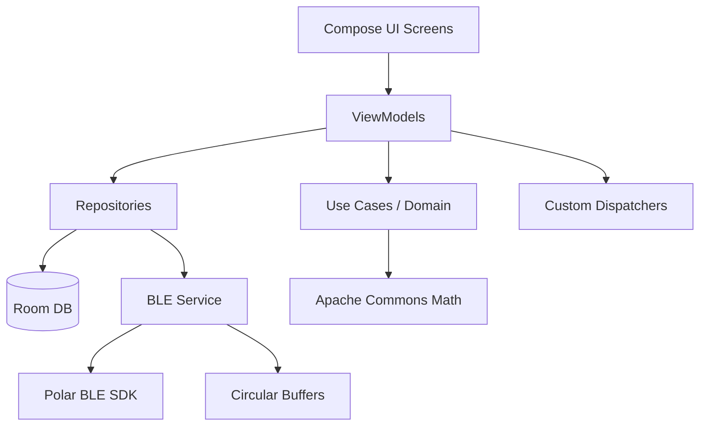
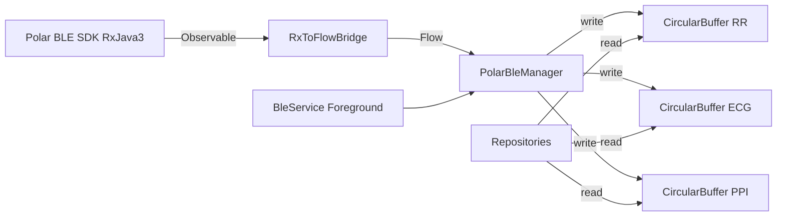
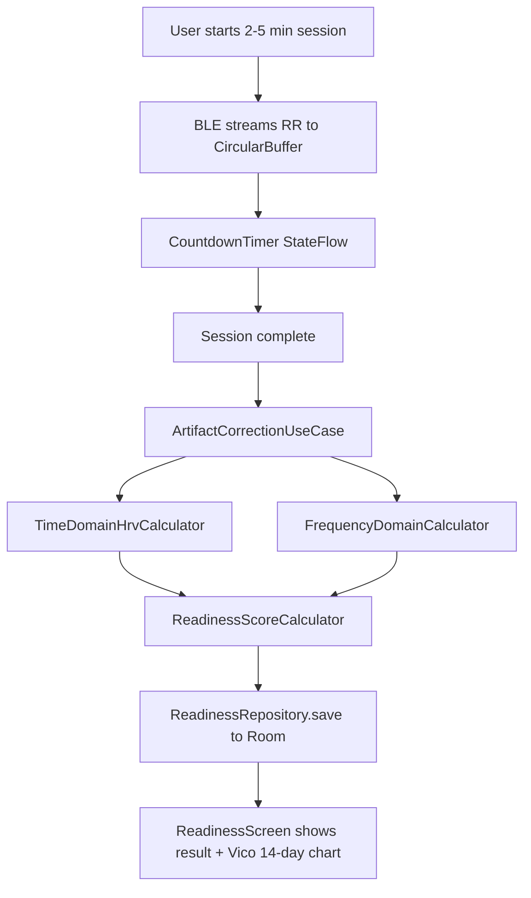
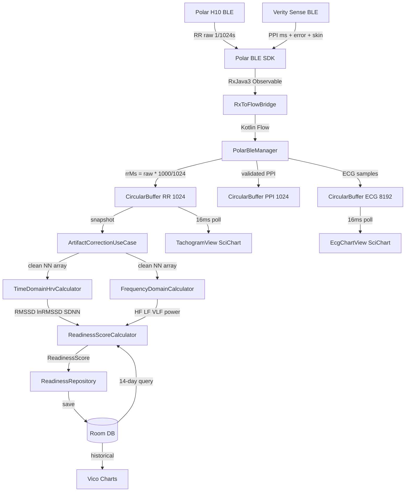

# WAGS — Cardiac Biofeedback App: Full Architecture Plan
*Last updated: 2026-03-09 (v2 — enriched with hrvm reference project analysis)*

---

## 0. Project Overview

**WAGS** is a clinical-grade Android biofeedback application targeting Polar H10 (ECG/RR) and Polar Verity Sense (PPG/PPI) hardware. It provides:
- Morning HRV Readiness Scoring
- Resonance Frequency Breathing (HRVB) biofeedback
- Static Apnea training tables
- Meditation / NSDR session analytics

The existing project is a bare Jetpack Compose scaffold (`com.example.wags`, `minSdk 26`, `compileSdk 36`). Everything must be built from scratch on top of it.

---

## 1. Package Structure

```
com.example.wags/
├── di/                          # Hilt modules
│   ├── AppModule.kt
│   ├── DatabaseModule.kt
│   ├── BleModule.kt
│   └── DispatcherModule.kt
│
├── data/
│   ├── ble/                     # BLE / Polar SDK layer
│   │   ├── PolarBleManager.kt
│   │   ├── BleService.kt        # Foreground Service
│   │   ├── RxToFlowBridge.kt
│   │   └── CircularBuffer.kt
│   │
│   ├── db/                      # Room database
│   │   ├── WagsDatabase.kt
│   │   ├── entity/
│   │   │   ├── DailyReadingEntity.kt
│   │   │   ├── ApneaRecordEntity.kt
│   │   │   └── SessionLogEntity.kt
│   │   └── dao/
│   │       ├── DailyReadingDao.kt
│   │       ├── ApneaRecordDao.kt
│   │       └── SessionLogDao.kt
│   │
│   └── repository/
│       ├── ReadinessRepository.kt
│       ├── ApneaRepository.kt
│       └── SessionRepository.kt
│
├── domain/
│   ├── model/                   # Pure Kotlin domain models
│   │   ├── RrInterval.kt
│   │   ├── HrvMetrics.kt
│   │   ├── ReadinessScore.kt
│   │   ├── ApneaRecord.kt
│   │   ├── ApneaTable.kt
│   │   └── SessionMetrics.kt
│   │
│   └── usecase/
│       ├── hrv/
│       │   ├── ArtifactCorrectionUseCase.kt
│       │   ├── TimeDomainHrvCalculator.kt
│       │   └── FrequencyDomainCalculator.kt
│       ├── readiness/
│       │   └── ReadinessScoreCalculator.kt
│       ├── breathing/
│       │   └── CoherenceScoreCalculator.kt
│       ├── apnea/
│       │   ├── ApneaTableGenerator.kt
│       │   └── ApneaStateMachine.kt
│       └── session/
│           └── NsdrAnalyticsCalculator.kt
│
├── ui/
│   ├── navigation/
│   │   └── WagsNavGraph.kt
│   │
│   ├── dashboard/
│   │   ├── DashboardScreen.kt
│   │   └── DashboardViewModel.kt
│   │
│   ├── readiness/
│   │   ├── ReadinessScreen.kt
│   │   └── ReadinessViewModel.kt
│   │
│   ├── breathing/
│   │   ├── BreathingScreen.kt
│   │   └── BreathingViewModel.kt
│   │
│   ├── apnea/
│   │   ├── ApneaScreen.kt
│   │   ├── ApneaTableScreen.kt
│   │   └── ApneaViewModel.kt
│   │
│   ├── session/
│   │   ├── SessionScreen.kt
│   │   └── SessionViewModel.kt
│   │
│   ├── realtime/
│   │   ├── EcgChartView.kt      # SciChart wrapper composable
│   │   └── TachogramView.kt
│   │
│   └── theme/
│       ├── Color.kt
│       ├── Theme.kt
│       └── Type.kt
│
└── MainActivity.kt
```

---

## 2. Dependency Graph (Mermaid)



---

## 3. Gradle Dependencies (`libs.versions.toml` additions)

### New versions to add:
```toml
[versions]
# Existing...
hilt = "2.51.1"
room = "2.6.1"
lifecycle-viewmodel = "2.8.7"
navigation-compose = "2.8.5"
coroutines = "1.8.1"
rxjava3 = "3.1.8"
rxandroid = "3.0.2"
coroutines-rx3 = "1.8.1"
polar-ble-sdk = "5.10.0"
commons-math = "3.6.1"
vico = "2.0.0"
# SciChart requires a commercial license — placeholder version
scichart = "4.4.0"

[libraries]
# DI
hilt-android = { group = "com.google.dagger", name = "hilt-android", version.ref = "hilt" }
hilt-compiler = { group = "com.google.dagger", name = "hilt-android-compiler", version.ref = "hilt" }
hilt-navigation-compose = { group = "androidx.hilt", name = "hilt-navigation-compose", version = "1.2.0" }

# Room
room-runtime = { group = "androidx.room", name = "room-runtime", version.ref = "room" }
room-ktx = { group = "androidx.room", name = "room-ktx", version.ref = "room" }
room-compiler = { group = "androidx.room", name = "room-compiler", version.ref = "room" }

# Lifecycle / ViewModel
lifecycle-viewmodel-compose = { group = "androidx.lifecycle", name = "lifecycle-viewmodel-compose", version.ref = "lifecycle-viewmodel" }
lifecycle-runtime-compose = { group = "androidx.lifecycle", name = "lifecycle-runtime-compose", version.ref = "lifecycle-viewmodel" }

# Navigation
navigation-compose = { group = "androidx.navigation", name = "navigation-compose", version.ref = "navigation-compose" }

# Coroutines
coroutines-android = { group = "org.jetbrains.kotlinx", name = "kotlinx-coroutines-android", version.ref = "coroutines" }
coroutines-rx3 = { group = "org.jetbrains.kotlinx", name = "kotlinx-coroutines-rx3", version.ref = "coroutines-rx3" }

# RxJava3
rxjava3 = { group = "io.reactivex.rxjava3", name = "rxjava", version.ref = "rxjava3" }
rxandroid3 = { group = "io.reactivex.rxjava3", name = "rxandroid", version.ref = "rxandroid" }

# Polar BLE SDK (via Maven)
polar-ble-sdk = { group = "com.github.polarofficial", name = "polar-ble-sdk", version.ref = "polar-ble-sdk" }

# Apache Commons Math
commons-math3 = { group = "org.apache.commons", name = "commons-math3", version.ref = "commons-math" }

# Vico (historical charts)
vico-compose = { group = "com.patrykandpatrick.vico", name = "compose-m3", version.ref = "vico" }

# SciChart (real-time charts — requires commercial license + local AAR or Maven credentials)
# scichart-core = { group = "com.scichart.library", name = "core", version.ref = "scichart" }

[plugins]
# Existing...
hilt = { id = "com.google.dagger.hilt.android", version.ref = "hilt" }
ksp = { id = "com.google.devtools.ksp", version = "2.0.21-1.0.28" }
```

> **Real-Time Chart Decision (Personal Project — No Commercial License):** SciChart and LightningChart both require commercial licenses. For this personal project, real-time ECG and tachogram rendering will use a **custom hardware-accelerated `Canvas` composable** built directly in Jetpack Compose. Android's `Canvas` API is GPU-accelerated via `RenderNode` on API 29+ and can sustain 60 FPS for line chart rendering when implemented correctly. The interface contract (`RealTimeChartDataSource`) is defined in the domain layer so the implementation remains swappable if a commercial license is obtained later.

---

## 4. Phase 1 — Foundation & Architecture Setup

### 4.1 Hilt DI Modules

**`DispatcherModule.kt`** — Provides named coroutine dispatchers:
- `@IoDispatcher` → `Dispatchers.IO` (BLE callbacks, DB)
- `@MathDispatcher` → `Dispatchers.Default` (FFT, artifact correction)
- `@MainDispatcher` → `Dispatchers.Main.immediate` (UI updates only)

**`DatabaseModule.kt`** — Provides `WagsDatabase` singleton and all DAOs.

**`BleModule.kt`** — Provides `PolarBleApiDefaultImpl` singleton, initialized with all three `PolarBleSdkFeature` flags.

### 4.2 Room Database

#### `DailyReadingEntity`
```kotlin
@Entity(tableName = "daily_readings")
data class DailyReadingEntity(
    @PrimaryKey(autoGenerate = true) val readingId: Long = 0,
    val timestamp: Long,           // epoch ms
    val restingHrBpm: Float,
    val rawRmssdMs: Float,
    val lnRmssd: Float,            // core metric for Z-score
    val hfPowerMs2: Float,
    val sdnnMs: Float,
    val readinessScore: Int        // 1-100
)
```

#### `ApneaRecordEntity`
```kotlin
@Entity(tableName = "apnea_records")
data class ApneaRecordEntity(
    @PrimaryKey(autoGenerate = true) val recordId: Long = 0,
    val timestamp: Long,
    val durationMs: Long,
    val lungVolume: String,        // "FULL" | "EMPTY" | "PARTIAL"
    val hyperventilationPrep: Boolean,
    val minHrBpm: Float,
    val maxHrBpm: Float,
    val tableType: String?         // "O2" | "CO2" | "FREE" | null
)
```

#### `SessionLogEntity`
```kotlin
@Entity(tableName = "session_logs")
data class SessionLogEntity(
    @PrimaryKey(autoGenerate = true) val sessionId: Long = 0,
    val timestamp: Long,
    val durationMs: Long,
    val sessionType: String,       // "MEDITATION" | "NSDR" | "BREATHING"
    val avgHrBpm: Float,
    val hrSlopeBpmPerMin: Float,   // negative = bradycardia
    val startRmssdMs: Float,
    val endRmssdMs: Float,
    val lnRmssdSlope: Float        // positive = parasympathetic upregulation
)
```

### 4.3 Custom Dispatchers for Math

```kotlin
// In DispatcherModule.kt
val mathDispatcher: CoroutineDispatcher = Executors
    .newFixedThreadPool(2) { r -> Thread(r, "wags-math-$it") }
    .asCoroutineDispatcher()
```

This keeps FFT and artifact correction off both `Dispatchers.Main` and the shared `Dispatchers.Default` pool.

---

## 5. Phase 2 — BLE Service Layer

### 5.1 Architecture Overview



### 5.2 `CircularBuffer<T>`

A pre-allocated, fixed-size, thread-safe ring buffer using an `AtomicInteger` write pointer and a `ReentrantReadWriteLock`. This prevents GC pressure from dynamic array growth during continuous BLE ingestion.

```kotlin
class CircularBuffer<T>(private val capacity: Int) {
    private val buffer: Array<Any?> = arrayOfNulls(capacity)
    private val writeIndex = AtomicInteger(0)
    private val lock = ReentrantReadWriteLock()

    fun write(value: T) { /* lock write, overwrite oldest */ }
    fun readLast(n: Int): List<T> { /* lock read, return snapshot */ }
    fun size(): Int
}
```

Sizes:
- RR buffer: 1024 intervals (~17 min at 60bpm)
- ECG buffer: 8192 samples (130Hz × 63s)
- PPI buffer: 1024 intervals

### 5.3 `RxToFlowBridge.kt`

Bridges Polar SDK's `Observable<T>` / `Flowable<T>` to Kotlin `Flow<T>` using `kotlinx-coroutines-rx3`:

```kotlin
fun <T> Observable<T>.toKotlinFlow(): Flow<T> =
    this.toFlowable(BackpressureStrategy.BUFFER).asFlow()
```

### 5.4 `PolarBleManager.kt`

Responsibilities:
- Holds `PolarBleApi` instance (injected via Hilt)
- Exposes `StateFlow<BleConnectionState>` per device
- Starts/stops HR, RR, ECG, PPI streams
- **H10 RR conversion:** `rrMs = rrRaw * (1000.0 / 1024.0)` applied per interval in the packet array
- **Verity Sense:** Commands `startSdkMode()`, awaits `getSdkModeStatus()`, then starts PPI stream; discards samples where `skinContact == false` OR `errorEstimate > THRESHOLD_MS` (configurable, default 10ms)
- Writes converted values to the appropriate `CircularBuffer`

### 5.5 `BleService.kt`

A `LifecycleService` (foreground service) that:
- Holds a `WakeLock` to prevent CPU sleep during measurements
- Exposes a `ServiceConnection` binder for ViewModels
- Posts a persistent notification with device connection status
- Manages the lifecycle of `PolarBleManager`

### 5.6 BLE Permissions

`AndroidManifest.xml` additions:
```xml
<!-- Android 12+ -->
<uses-permission android:name="android.permission.BLUETOOTH_SCAN"
    android:usesPermissionFlags="neverForLocation" />
<uses-permission android:name="android.permission.BLUETOOTH_CONNECT" />
<!-- Android < 12 -->
<uses-permission android:name="android.permission.ACCESS_FINE_LOCATION" />
<!-- Foreground service -->
<uses-permission android:name="android.permission.FOREGROUND_SERVICE" />
<uses-permission android:name="android.permission.WAKE_LOCK" />
```

Runtime permission request handled in a dedicated `BlePermissionManager` composable using `rememberLauncherForActivityResult`.

---

## 6. Phase 3 — Algorithmic Engine

All use cases run on `@MathDispatcher`. They are pure functions (no Android dependencies) for testability.

### 6.1 `ArtifactCorrectionUseCase.kt`

Implements the **Lipponen & Tarvainen 2019** algorithm in three phases:

**Phase 1 — Difference Series:**
```
dRRs(j) = RR(j) - RR(j-1)
QD = (Q3 - Q1) / 2  over 91-beat sliding window
Th1(j) = 5.2 × QD
dRR(j) = dRRs(j) / Th1(j)   [normalized]
```

**Phase 2 — Median Comparison:**
```
mRRs(j) = RR(j) - median(11-beat window centered on j)
Th2 computed same as Th1
mRR(j) = mRRs(j) / Th2(j)
```

**Phase 3 — S1/S2 Classification:**
```
S1_1(j) = dRR(j)
S1_2(j) = max(dRR(j-1), dRR(j+1))  if dRR(j) > 0
         = min(dRR(j-1), dRR(j+1))  if dRR(j) < 0
c1 = 0.13, c2 = 0.17
```

**Correction Actions:**
- **Missed beat** (interval too long): divide by 2, insert synthetic beat
- **Extra beat** (two short intervals): merge into one
- **Ectopic beat**: discard, replace via **Cubic Spline Interpolation** using `SplineInterpolator` from Apache Commons Math

Output: `DoubleArray` of corrected NN intervals in milliseconds.

### 6.2 `TimeDomainHrvCalculator.kt`

Input: corrected NN interval array (ms)

```
RMSSD = sqrt( (1/(N-1)) * Σ(NN[i+1] - NN[i])² )
ln(RMSSD) = ln(RMSSD)
SDNN = stdDev(NN array)
pNN50 = count(|NN[i+1] - NN[i]| > 50) / (N-1) * 100
```

Returns `HrvMetrics` domain model.

### 6.3 `FrequencyDomainCalculator.kt`

Pipeline using Apache Commons Math:

1. **Cubic Spline Resampling to 4 Hz:**
   - Build cumulative time axis from NN intervals
   - `SplineInterpolator().interpolate(timeAxis, nnArray)`
   - Evaluate at uniform 0.25s steps → `resampledArray`

2. **Detrending:**
   - Subtract mean: `detrended[i] = resampled[i] - mean`

3. **Hanning Window:**
   ```
   w[i] = 0.5 * (1 - cos(2π * i / (N-1)))
   windowed[i] = detrended[i] * w[i]
   ```

4. **Zero-pad to next power of 2** (for FFT efficiency)

5. **FFT via `FastFourierTransformer`:**
   ```kotlin
   val fft = FastFourierTransformer(DftNormalization.STANDARD)
   val complex = fft.transform(windowed, TransformType.FORWARD)
   ```

6. **PSD Calculation:**
   ```
   psd[k] = (real[k]² + imag[k]²) / (N * fs)
   ```

7. **Band Integration (trapezoidal rule):**
   - VLF: 0.0033–0.04 Hz
   - LF: 0.04–0.15 Hz
   - HF: 0.15–0.40 Hz

Returns `FrequencyDomainMetrics(vlfPower, lfPower, hfPower, lfHfRatio)`.

### 6.4 `ReadinessScoreCalculator.kt`

```
1. Query last 14 DailyReadingEntity rows from Room → lnRmssdHistory[]
2. μ = mean(lnRmssdHistory)
3. σ = stdDev(lnRmssdHistory)
4. Z = (currentLnRmssd - μ) / σ
5. Map Z to 1-100 scale:
   - Z in [-0.5, 0.5]  → 70-85 (Optimal zone)
   - Z < -1.0          → linear scale down to 1
   - Z > 1.5           → scale down (overreaching signal)
   - Z in [0.5, 1.5]   → scale up to 100
```

Returns `ReadinessScore(score: Int, zScore: Float, interpretation: ReadinessInterpretation)`.

---

## 7. Phase 4 — Core Feature Business Logic

### 7.1 Morning Readiness Flow



### 7.2 Resonance Frequency Breathing

**Pacing Engine (`BreathingViewModel`):**
- User selects rate: 4.0–7.0 BPM in 0.5 increments
- Inhale duration = `(60.0 / rate) / 2` seconds
- Exhale duration = same (equal ratio default; configurable)
- Compose `Animatable` drives a circular visual pacer
- `LaunchedEffect(breathingRate)` with `while(isActive)` loop

**Discovery Mode:**
- State machine cycles through rates: 4.5 → 5.0 → 5.5 → 6.0 → 6.5 BPM
- 5 minutes per rate
- Records coherence score at each rate
- Presents ranked results

**Coherence Score (Time-Domain — recommended for battery):**
```
For each breath cycle:
  amplitude = maxHR(exhale_start) - minHR(inhale_start)
Over last 5 breaths:
  μ_amp = mean(amplitudes)
  σ_amp = stdDev(amplitudes)
  coherence = (μ_amp - W * σ_amp) * S
  W = 0.5, S = 1.0 (tunable constants)
Normalize to 0-100 scale
```

**Coherence Score (FFT — precision mode):**
- 64-second sliding window, updated every 5s
- Peak at ~0.1 Hz (resonance frequency)
- `ratio = peakPower / (totalPower - peakPower)`

### 7.3 Apnea Engine

**`ApneaTableGenerator.kt`:**

*O2 Table (Hypoxia — constant ventilation, increasing apnea):*
```
ventilationMs = 2 * 60 * 1000  (constant)
apneaSteps = [0.5, 0.6, 0.7, 0.75, 0.8] * PB_ms  (capped at 80% PB)
rounds = 6-8
```

*CO2 Table (Hypercapnia — decreasing ventilation, constant apnea):*
```
apneaMs = 0.5 * PB_ms  (constant)
ventilationSteps = [2.0, 1.75, 1.5, 1.25, 1.0] * 60 * 1000
rounds = 6-8
```

**`ApneaStateMachine.kt`:**

States: `IDLE → VENTILATION → APNEA → RECOVERY → COMPLETE`

Countdown triggers (before state transition):
- 10s: visual flash + haptic `VibrationEffect.createOneShot(100ms)`
- 5s: audio beep + haptic
- 3s, 2s, 1s: rapid haptic pulses + audio tones

Uses `SoundPool` for low-latency audio (not `MediaPlayer`).

**Free Hold Logger:**
- Toggles: lung volume (FULL/EMPTY/PARTIAL), hyperventilation prep (Y/N)
- Records: duration, min/max HR from BLE stream
- Saves to `ApneaRecordEntity`

### 7.4 NSDR / Meditation Analytics

**`NsdrAnalyticsCalculator.kt`:**

*Bradycardia Detection (Linear Regression):*
```kotlin
// Using Apache Commons Math SimpleRegression
val regression = SimpleRegression()
hrTimeSeries.forEachIndexed { i, hr -> regression.addData(i.toDouble(), hr) }
val slope = regression.slope  // target: negative and flattening
```

*RMSSD Trajectory:*
- Calculate `ln(RMSSD)` in 60s rolling windows throughout session
- Run `SimpleRegression` on `ln(RMSSD)` vs time
- Positive slope = parasympathetic upregulation confirmed

*Autonomic Balance Index (ABI):*
- Isolate RSA fraction: HF power / (LF + HF power) from frequency domain
- Computed at session start, midpoint, and end
- Rising ABI = true vagal enhancement

---

## 8. Phase 5 — High-Performance UI

### 8.1 Real-Time Chart Architecture (60 FPS)

**Critical Rule:** BLE callbacks write to `CircularBuffer`. A dedicated UI coroutine polls the buffer every 16ms on `Dispatchers.Main`. It reads only the visible window subset and updates chart state. **Never push data directly from BLE callback to UI.**

```kotlin
// In ViewModel
LaunchedEffect(Unit) {
    while (isActive) {
        delay(16L)  // ~60 FPS
        val visibleWindow = ecgCircularBuffer.readLast(VISIBLE_SAMPLES)
        _ecgChartState.value = visibleWindow
    }
}
```

**Chart Implementation: Custom Hardware-Accelerated `Canvas` Composable (Free, No License Required)**

Android's `Canvas` API is GPU-accelerated via `RenderNode` on API 29+. For API 26–28 (our `minSdk`), `View.setLayerType(LAYER_TYPE_HARDWARE, null)` provides hardware acceleration fallback.

**`EcgChartView.kt`** — Pure Jetpack Compose `Canvas` composable:
```kotlin
@Composable
fun EcgChartView(samples: FloatArray, modifier: Modifier = Modifier) {
    // samples: pre-allocated FloatArray snapshot from CircularBuffer (max 520 = 4s at 130Hz)
    // Recomposition triggered by the 16ms ViewModel poll emitting a new array reference
    val path = remember { Path() }
    Canvas(modifier = modifier.background(Color.Black)) {
        path.reset()  // reuse Path object — never allocate per frame
        if (samples.isEmpty()) return@Canvas
        val xStep = size.width / (samples.size - 1)
        val midY = size.height / 2f
        val scale = size.height / 4000f  // ECG amplitude scale (µV)
        samples.forEachIndexed { i, v ->
            val x = i * xStep
            val y = midY - v * scale
            if (i == 0) path.moveTo(x, y) else path.lineTo(x, y)
        }
        drawPath(path, color = Color(0xFF00E5FF), strokeWidth = 1.5.dp.toPx(), style = Stroke())
    }
}
```

**Performance rules for the custom Canvas chart:**
- Pass a **`FloatArray` snapshot** (not `List<Float>`) — avoids boxing/unboxing GC pressure
- `remember { Path() }` + `path.reset()` each frame — reuse the `Path` object, never allocate a new one per frame
- Keep visible window ≤ **520 samples** (4 seconds at 130 Hz ECG) — rendering more is wasteful
- ViewModel must emit a **new array reference** each 16ms tick (`circularBuffer.readLast(n).toFloatArray()`) so Compose detects the state change
- For the tachogram, use `drawPoints()` with `PointMode.Lines` — faster than `Path` for sparse RR scatter data

**`TachogramView.kt`** — Same `Canvas` pattern for RR interval tachogram (scatter dots + connecting lines).

### 8.2 Historical Charts (Vico)

**14-Day Readiness Dashboard:**
- `CartesianChartHost` with `LineLayer` for daily `ln(RMSSD)`
- `LineLayer` for rolling mean ± 1 SD band (shaded area)
- Z-score markers as `ColumnLayer` overlay

### 8.3 Navigation Structure

```
WagsNavGraph
├── Dashboard (home)
├── Readiness
│   ├── ReadinessSession (live BLE + countdown)
│   └── ReadinessHistory (Vico 14-day chart)
├── Breathing
│   ├── BreathingSession (Animatable pacer + coherence)
│   └── BreathingDiscovery (rate testing state machine)
├── Apnea
│   ├── ApneaFreeHold (logger)
│   ├── ApneaO2Table (generated table + state machine)
│   └── ApneaCO2Table
└── Session
    ├── MeditationSession (live analytics)
    └── SessionHistory
```

### 8.4 Breathing Pacer Composable

```kotlin
@Composable
fun BreathingPacer(breathingRateBpm: Float) {
    val animatable = remember { Animatable(0f) }
    val inhaleDuration = ((60f / breathingRateBpm) / 2f * 1000f).toInt()

    LaunchedEffect(breathingRateBpm) {
        while (isActive) {
            animatable.animateTo(1f, tween(inhaleDuration, easing = LinearEasing))
            animatable.animateTo(0f, tween(inhaleDuration, easing = LinearEasing))
        }
    }
    // Draw expanding/contracting circle using animatable.value
    Canvas(modifier = Modifier.size(200.dp)) {
        drawCircle(radius = size.minDimension / 2 * animatable.value)
    }
}
```

---

## 9. Data Flow Diagram (Full System)



---

## 10. Key Architectural Decisions & Rationale

| Decision | Choice | Rationale |
|---|---|---|
| BLE SDK | Official Polar BLE SDK v5+ | Direct hardware support, RR/ECG/PPI access |
| RxJava bridge | `kotlinx-coroutines-rx3` | Minimal overhead, preserves backpressure |
| Circular Buffer | Custom pre-allocated | Prevents GC pauses during 130Hz ECG ingestion |
| Math library | Apache Commons Math 3 | `FastFourierTransformer` + `SplineInterpolator` + `SimpleRegression` all in one dep |
| Real-time charts | SciChart (OpenGL) | 60 FPS hardware-accelerated; MPAndroidChart prohibited |
| Historical charts | Vico | Native Compose declarative API, no View interop needed |
| DI | Hilt | Standard Android DI, integrates with ViewModel/WorkManager |
| DB | Room | Strictly typed, Flow-native queries, longitudinal data |
| Foreground Service | `LifecycleService` | Keeps BLE alive when app is backgrounded |
| Coroutine Dispatchers | Custom named thread pool for math | Isolates heavy computation from IO and Main pools |
| Artifact correction | Lipponen & Tarvainen 2019 | Gold-standard clinical algorithm for RR artifact removal |
| Coherence scoring | Time-domain amplitude (default) | Lower battery vs FFT; FFT available as precision mode |

---

## 11. File Count & Modularity Guardrails

Per the project rules, **no file may exceed 500 lines**. The following files are at risk and must be split:

| File | Strategy |
|---|---|
| `ArtifactCorrectionUseCase.kt` | Split into `Phase1DifferenceSeries.kt`, `Phase2MedianComparison.kt`, `Phase3Classification.kt`, orchestrated by `ArtifactCorrectionUseCase.kt` |
| `FrequencyDomainCalculator.kt` | Split into `SplineResampler.kt`, `FftProcessor.kt`, `PsdBandIntegrator.kt` |
| `ApneaStateMachine.kt` | Split into `ApneaCountdownTimer.kt` and `ApneaStateTransitionHandler.kt` |
| `BleService.kt` | Keep lean; delegate all stream logic to `PolarBleManager.kt` |

---

## 12. Implementation Order (Phased Execution for Code Mode)

### Phase 1 — Foundation (implement first, everything depends on this)
1. Update `gradle/libs.versions.toml` with all new dependencies
2. Update `app/build.gradle.kts` with all new dependencies + KSP plugin + Hilt plugin
3. Update `settings.gradle.kts` with JitPack repo (for Polar SDK)
4. Create `WagsApplication.kt` with `@HiltAndroidApp`
5. Update `AndroidManifest.xml` with permissions + service declaration + application class
6. Create `di/DispatcherModule.kt`
7. Create `di/DatabaseModule.kt`
8. Create `di/BleModule.kt`
9. Create `di/AppModule.kt`
10. Create all Room entities: `DailyReadingEntity`, `ApneaRecordEntity`, `SessionLogEntity`
11. Create all DAOs: `DailyReadingDao`, `ApneaRecordDao`, `SessionLogDao`
12. Create `WagsDatabase.kt`
13. Create all repositories: `ReadinessRepository`, `ApneaRepository`, `SessionRepository`
14. Create domain models: `RrInterval`, `HrvMetrics`, `ReadinessScore`, `ApneaRecord`, `ApneaTable`, `SessionMetrics`

### Phase 2 — BLE Layer
1. Create `CircularBuffer.kt`
2. Create `RxToFlowBridge.kt`
3. Create `PolarBleManager.kt` (H10 + Verity Sense streams, RR conversion, PPI validation)
4. Create `BleService.kt` (foreground service, WakeLock, notification)
5. Create `BlePermissionManager.kt` (Compose permission launcher)

### Phase 3 — Algorithmic Engine
1. Create `Phase1DifferenceSeries.kt`
2. Create `Phase2MedianComparison.kt`
3. Create `Phase3Classification.kt`
4. Create `ArtifactCorrectionUseCase.kt` (orchestrator)
5. Create `TimeDomainHrvCalculator.kt`
6. Create `SplineResampler.kt`
7. Create `FftProcessor.kt`
8. Create `PsdBandIntegrator.kt`
9. Create `FrequencyDomainCalculator.kt` (orchestrator)
10. Create `ReadinessScoreCalculator.kt`
11. Create `CoherenceScoreCalculator.kt`
12. Create `NsdrAnalyticsCalculator.kt`

### Phase 4 — Business Logic & ViewModels
1. Create `DashboardViewModel.kt` + `DashboardScreen.kt`
2. Create `ReadinessViewModel.kt` + `ReadinessScreen.kt`
3. Create `BreathingViewModel.kt` + `BreathingScreen.kt`
4. Create `ApneaTableGenerator.kt`
5. Create `ApneaCountdownTimer.kt` + `ApneaStateTransitionHandler.kt`
6. Create `ApneaStateMachine.kt` (orchestrator)
7. Create `ApneaViewModel.kt` + `ApneaScreen.kt` + `ApneaTableScreen.kt`
8. Create `SessionViewModel.kt` + `SessionScreen.kt`

### Phase 5 — UI & Charts
1. Create `EcgChartView.kt` (SciChart AndroidView wrapper)
2. Create `TachogramView.kt` (SciChart AndroidView wrapper)
3. Create `WagsNavGraph.kt`
4. Update `MainActivity.kt` to use NavGraph + Hilt
5. Update `ui/theme/` files for dark clinical aesthetic

### Phase 6 — Polish
1. Verify H10 multi-RR-per-packet handling
2. Verify Verity Sense SDK mode initialization sequence
3. Verify Z-score → 1-100 mapping edge cases
4. Add `SoundPool` audio cues to `ApneaCountdownTimer`
5. Add `VibrationEffect` haptic cues to `ApneaCountdownTimer`
6. Update `README.md`

---

## 13. README Update Plan

The `README.md` should document:
- App purpose and target hardware
- Setup requirements (SciChart license, Polar SDK JitPack)
- Architecture overview (link to this plan)
- Build instructions
- BLE permission notes per Android version

---

## 14. Improvements & Upgrades from `hrvm` Reference Project Analysis

The following changes **upgrade or replace** sections of the original plan based on battle-tested algorithms and patterns found in the `hrvm` Python reference project.

---

### 14.1 Artifact Rejection — Replace with Two-Stage Pipeline

**Original plan:** Lipponen & Tarvainen 2019 only.

**Upgrade:** Add a fast **pre-filter gate** before the full Lipponen pipeline. This mirrors `reject_rr_artifacts()` in [`math_utils.py`](/home/twain/Projects/hrvm/src/processing/math_utils.py:112) and prevents the Lipponen algorithm from wasting cycles on physiologically impossible values.

**New `RrPreFilter.kt`** (runs first, before `ArtifactCorrectionUseCase`):
```
Stage 1 — Absolute bounds: discard any RR outside [333ms, 1500ms]
           (333ms = 180 BPM, 1500ms = 40 BPM)
Stage 2 — Rolling median relative change:
           reference = median(last 9 valid beats)
           discard if |RR[i] - reference| / reference > 0.20 (20%)
           Uses rolling window of valid beats only — prevents "domino effect"
           where one ectopic causes the next normal beat to also be rejected
```

**Artifact-aware RMSSD** (from [`calculate_rmssd_artifact_aware()`](/home/twain/Projects/hrvm/src/processing/math_utils.py:33)):
- Compute successive differences on the **full** array (including artifact positions)
- Drop any difference where **either** of the two beats is flagged as artifact
- This avoids the "missing beat" flaw where deleting an artifact pairs two non-adjacent beats
- `TimeDomainHrvCalculator.kt` must accept an `artifactMask: BooleanArray` parameter

---

### 14.2 Interpolation — Replace CubicSpline with PchipInterpolator

**Original plan:** `SplineInterpolator` (Apache Commons Math natural cubic spline).

**Upgrade:** Use **PCHIP (Piecewise Cubic Hermite Interpolating Polynomial)** interpolation.

**Why:** As demonstrated in [`interpolate_rr_stream()`](/home/twain/Projects/hrvm/src/processing/math_utils.py:177), PCHIP is **monotonic** — it does not overshoot between data points (no Runge phenomenon). Standard cubic splines can produce negative RR values or wild oscillations between sparse beats, which then corrupt the FFT. PCHIP guarantees physiologically plausible interpolated values.

**Android implementation:** Apache Commons Math does not include PCHIP. Use the `SplineInterpolator` with a **monotone cubic** variant, or implement PCHIP directly (it is a well-defined algorithm). The `SplineResampler.kt` file must:
1. Sort input by time
2. Remove duplicate timestamps
3. Apply PCHIP interpolation
4. **Clamp output to [333ms, 1500ms]** after interpolation as a safety net

---

### 14.3 FFT / Coherence — Use Periodogram + Correct Window Size

**Original plan:** Raw `FastFourierTransformer` with manual PSD calculation.

**Upgrade from [`calculate_coherence_score()`](/home/twain/Projects/hrvm/src/processing/math_utils.py:280):**

**Critical window size constraint:**
- Use a **64-second window at 4 Hz = 256 samples** (power-of-2, optimal FFT performance)
- The lowest resolvable frequency in a 64s window is `1/64 ≈ 0.0156 Hz`
- **VLF (0.0033 Hz) is physically impossible to measure in a 64s window** — do not attempt it
- Total power floor must start at **0.015 Hz**, not 0.0033 Hz

**Coherence normalization (replace simple ratio):**
```
ratio = band_power / max(total_power - band_power, 1e-9)
score = tanh(ratio × 2.0) × 100.0
```
`tanh` gives smooth, bounded 0–100 output. The `1e-9` epsilon prevents zero-division when all power is in the target band (perfect resonance).

**Target band width:** ±0.03 Hz around the target breathing frequency (not a fixed HF band).

**Linear detrend before windowing:** Use `polyfit(degree=1)` to remove linear RR drift over the window, not just mean subtraction.

**SDNN buffer separation:** Maintain two separate buffers:
- 60-second rolling buffer for RMSSD (vagal tone, fast-changing)
- 5-minute rolling buffer for SDNN (Task Force 1996 minimum requirement)
- Never compute SDNN from a sub-5-minute window and present it as clinically valid

---

### 14.4 Resonance Frequency Assessment — Three-Protocol System

**Original plan:** Single "Discovery Mode" cycling through rates.

**Upgrade:** Implement the full three-protocol system from [`resonance_math.py`](/home/twain/Projects/hrvm/src/processing/resonance_math.py) and [`resonance_breathing.py`](/home/twain/Projects/hrvm/src/gui/resonance_breathing.py):

#### Protocol 1: Stepped Assessment (Express / Standard / Deep)
- **Baseline phase** (2 min): user breathes normally; captures baseline RMSSD, LF power, PT amplitude
- **Test blocks**: each rate tested for a fixed duration (1–3 min depending on preset)
- **Washout periods** between blocks (30–60s): user breathes normally to reset autonomic state
- **Presets:**
  - Express (~8 min): 5 rates × 1 min test + 30s washout
  - Standard (~18 min): 5 rates × 2 min test + 60s washout
  - Deep Calibration (~42 min): 13 rate/ratio combinations × 3 min test

#### Protocol 2: Continuous Sliding Window (~16 min)
- Uses `ContinuousPacer`: analytically integrated phase to prevent mathematical discontinuities
- Breathing rate sweeps continuously from ~6.75 BPM down to ~4.5 BPM over 78 breaths
- Post-session analysis uses **Continuous Wavelet Transform (CWT)** on the RR series
- **Hilbert Phase Locking Value (PLV)** measures instantaneous phase synchrony between HR and breath reference wave
- **5-second baroreflex delay correction** applied when finding the resonance peak

#### Protocol 3: Targeted Micro-Adjustment
- Requires historical optimal BPM from a previous session
- Tests: `[optimal, optimal+0.2, optimal-0.2]` BPM
- Fastest protocol (~10 min) for fine-tuning

#### Composite Epoch Score Formula (from [`score_epoch()`](/home/twain/Projects/hrvm/src/processing/resonance_math.py:91)):
```
score = (phase_synchrony × 0.40)
      + (min(pt_amplitude / baseline_pt, 5.0) × 0.30)
      + (min(lf_nu / 100.0, 1.0) × 0.20)
      + (min(rmssd / baseline_rmssd, 5.0) × 0.10)
score × 100  → 0–260+ scale (not 0–100)
```

#### Quality Gates (do not save inconclusive results):
- **Stepped:** `phase_synchrony >= 0.25` AND `pt_amplitude >= 1.5 BPM`
- **Continuous:** `max(PLV) >= 0.3` AND `peak_resonance_index / mean_resonance_index >= 1.5`
- Epochs failing quality gates are flagged with a warning marker, not silently discarded

#### Inhale:Exhale Ratio Support:
- The pacer must support asymmetric breathing (e.g., 1:1.5 inhale:exhale ratio)
- `inhaleDuration = cycleDuration / (1.0 + ratio)`
- `exhaleDuration = cycleDuration - inhaleDuration`
- `BreathingViewModel` must expose `breathingRateBpm: Float` AND `ieRatio: Float`

#### Leaderboard Color Scale (for coherence score display):
```
Score ≥ 245 → White  (extraordinary)
Score ≥ 230 → Yellow (exceptional)
Score ≥ 210 → Pink   (excellent)
Score ≥ 170 → Blue   (very good)
Score ≥ 130 → Green  (good)
Score ≥  80 → Orange (fair)
Score <  80 → Red    (low)
```

#### New Room Entity: `RfAssessmentEntity`
```kotlin
@Entity(tableName = "rf_assessments")
data class RfAssessmentEntity(
    @PrimaryKey(autoGenerate = true) val assessmentId: Long = 0,
    val timestamp: Long,
    val protocolType: String,       // "EXPRESS" | "STANDARD" | "DEEP" | "CONTINUOUS" | "TARGETED"
    val optimalBpm: Float,
    val optimalIeRatio: Float,
    val compositeScore: Float,
    val isValid: Boolean,
    val leaderboardJson: String     // JSON array of all epoch results
)
```

---

### 14.5 Phase Synchrony Metric

**New addition** (from [`calculate_phase_synchrony()`](/home/twain/Projects/hrvm/src/processing/resonance_math.py:62)):

For stepped protocol epochs, compute **cross-correlation phase synchrony**:
```
1. Resample RR → IHR (BPM) at 4 Hz using PCHIP
2. Generate synthetic respiratory reference wave from pacer timing
3. Normalize both signals (zero-mean, unit variance)
4. Cross-correlate: find lag that maximizes correlation
5. phase_synchrony = 1.0 - (|best_lag_sec| / (cycle_duration / 2))
   → 1.0 = perfect sync, 0.0 = completely out of phase
```

Add `calculatePhaseSynchrony()` to `CoherenceScoreCalculator.kt`.

---

### 14.6 PT Amplitude Metric

**New addition** (from [`calculate_pt_amplitude()`](/home/twain/Projects/hrvm/src/processing/resonance_math.py:27)):

Peak-to-trough HR amplitude per breath cycle — the primary RSA indicator:
```
For each breath cycle [start, end]:
  cycle_hr = IHR values within [start, end]
  pt_amplitude = max(cycle_hr) - min(cycle_hr)
mean_pt_amplitude = mean(all cycle amplitudes)
```

This is more physiologically meaningful than raw RMSSD for resonance assessment because it directly measures the RSA swing magnitude per breath.

Add `calculatePtAmplitude()` to `CoherenceScoreCalculator.kt`.

---

### 14.7 Coherence Score — Carry-Forward Anti-Saw-Tooth

**From [`signal_processor.py`](/home/twain/Projects/hrvm/src/processing/signal_processor.py:82):**

The coherence score must **carry forward** the last valid non-zero value between updates. Without this, the score oscillates between 0 and the real value every update cycle, creating a "saw-tooth" artifact in the UI.

```kotlin
// In BreathingViewModel
private var lastCoherenceScore: Float = 0f

fun updateCoherence(newScore: Float) {
    if (newScore > 0f) lastCoherenceScore = newScore
    _coherenceState.value = lastCoherenceScore  // always emit last known good value
}
```

Coherence should be recalculated at most **once per second** (not on every RR interval arrival).

---

### 14.8 H10 Accelerometer Respiration Detection (New Feature)

**From [`acc_respiration.py`](/home/twain/Projects/hrvm/src/processing/acc_respiration.py):**

The Polar H10 streams **200 Hz accelerometer data** (X/Y/Z axes). The Z-axis signal can be used to detect breathing phase in real-time without a separate respiratory belt.

**New `AccRespirationEngine.kt`** in `data/ble/`:
- Feeds on H10 ACC Z-axis samples at 200 Hz
- Computes smoothed delta: `mean(last 20 samples) - mean(samples 80-20 ago)`
- Hysteresis-based phase detection: INHALING / EXHALING / HOLDING
- Debounce: 2 samples for breath transitions, 10 samples for hold detection
- Outputs `currentBreathRateBpm: Float?` and `currentPhase: BreathPhase`
- Per-profile calibration (standing/sitting/laying, with/without hold)
- Calibration persists to Room DB as `AccCalibrationEntity`

**Integration with Coherence:** When ACC breath rate is available, use it as the `targetFreq` for coherence calculation instead of the prescribed pacer rate. This gives a **true physiological coherence** score rather than a prescribed-rate score.

**New `PolarBleSdkFeature`** to enable: `FEATURE_POLAR_SENSOR_STREAMING` already covers ACC. Add `startAccStreaming(deviceId, AccelerometerSensorSetting)` call in `PolarBleManager.kt`.

---

### 14.9 CircularBuffer — Separate Read/Write Indices

**From [`ring_buffer.py`](/home/twain/Projects/hrvm/src/ble/ring_buffer.py):**

The original plan's `CircularBuffer` used a single `AtomicInteger` write pointer. The reference project uses **separate read and write indices** with a `count` field, enabling both `read(n)` (non-destructive peek) and `consume(n)` (destructive read) operations.

**Updated `CircularBuffer<T>` design:**
```kotlin
class CircularBuffer<T>(val capacity: Int) {
    private val buffer: Array<Any?> = arrayOfNulls(capacity)
    private val lock = ReentrantReadWriteLock()
    private var writeIdx = 0
    private var readIdx = 0
    private var count = 0

    fun write(value: T)           // overwrite oldest if full
    fun writeBatch(values: List<T>) // batch write with wrap-around
    fun readLast(n: Int): List<T>  // non-destructive: last n written values
    fun consume(n: Int): List<T>   // destructive: advance read pointer
    fun size(): Int
    fun isFull(): Boolean
}
```

The **ECG buffer** specifically needs `writeBatch()` since ECG arrives in batches of ~13 samples per BLE packet at 130 Hz.

---

### 14.10 Session Export / Raw Data Recording

**From [`session_recorder.py`](/home/twain/Projects/hrvm/src/recording/session_recorder.py):**

Add a `SessionExporter.kt` use case that can export any completed session to a structured JSON file:
```json
{
  "format_version": "1.0",
  "device": { "name": "Polar H10", "id": "..." },
  "session": { "start_utc": "...", "duration_seconds": 300 },
  "rr_intervals": { "samples": [{"t": 0, "rr_ms": 832}, ...] },
  "rmssd": { "window_size_seconds": 5, "samples": [{"t": 0, "value": 42.1}, ...] }
}
```

This enables offline analysis, sharing with clinicians, and future import into other tools. Store exports in Android's `getExternalFilesDir(Environment.DIRECTORY_DOCUMENTS)`.

---

### 14.11 Audio Feedback — Continuous Pitch Sonification

**From [`audio_feedback.py`](/home/twain/Projects/hrvm/src/gui/audio_feedback.py):**

Beyond the apnea countdown beeps, add an optional **continuous HR sonification** mode for meditation/NSDR sessions:
- Maps HR (40–100 BPM) → pitch (220–440 Hz, A3–A4)
- Uses `AudioTrack` in streaming mode with a 1024-sample buffer
- Smooth frequency transitions (portamento) via exponential smoothing: `currentFreq += (targetFreq - currentFreq) × 0.1`
- 20ms linear fade-in/fade-out on each buffer to prevent clicks
- Implemented in `HrSonificationEngine.kt` in `domain/usecase/session/`

---

### 14.12 Updated Package Structure (Additions)

New files added to the package structure from the above improvements:

```
com.example.wags/
├── data/
│   ├── ble/
│   │   ├── AccRespirationEngine.kt      ← NEW: H10 ACC breathing detection
│   │   └── ...
│   └── db/
│       └── entity/
│           ├── RfAssessmentEntity.kt    ← NEW: RF assessment results
│           └── AccCalibrationEntity.kt  ← NEW: ACC calibration profiles
│
├── domain/
│   └── usecase/
│       ├── hrv/
│       │   ├── RrPreFilter.kt           ← NEW: Two-stage pre-filter gate
│       │   ├── PchipResampler.kt        ← REPLACES: SplineResampler.kt
│       │   └── ...
│       ├── breathing/
│       │   ├── CoherenceScoreCalculator.kt  ← EXPANDED: + phase synchrony + PT amplitude
│       │   ├── ContinuousPacerEngine.kt     ← NEW: Analytically integrated sliding pacer
│       │   └── RfAssessmentOrchestrator.kt  ← NEW: Multi-protocol RF assessment state machine
│       └── session/
│           ├── HrSonificationEngine.kt  ← NEW: Continuous pitch sonification
│           └── SessionExporter.kt       ← NEW: JSON export
```

---

### 14.13 Summary of All Changes to Original Plan

| Section | Original | Upgraded To |
|---|---|---|
| Artifact rejection | Lipponen only | Two-stage pre-filter + Lipponen + artifact-aware RMSSD |
| Interpolation | `SplineInterpolator` (cubic) | PCHIP (monotonic, no Runge phenomenon) |
| FFT window | Unspecified | 64s × 4Hz = 256 samples (power-of-2); VLF excluded |
| Coherence normalization | Simple ratio | `tanh(ratio × 2.0) × 100` with epsilon guard |
| Coherence detrend | Mean subtraction | Linear `polyfit(degree=1)` detrend |
| Coherence update | Every RR interval | Max 1 Hz with carry-forward anti-saw-tooth |
| SDNN buffer | Single buffer | Separate 60s (RMSSD) and 5-min (SDNN) buffers |
| RF Discovery Mode | Simple rate cycling | Three protocols: Stepped / Continuous CWT+PLV / Targeted |
| RF scoring | Not specified | Composite score: phase×0.4 + PT×0.3 + LFnu×0.2 + RMSSD×0.1 |
| RF quality gates | None | PLV threshold + peak shape ratio; invalid epochs flagged |
| Breathing pacer | 1:1 ratio only | Configurable inhale:exhale ratio |
| Coherence metric | FFT band ratio only | + Phase synchrony (cross-correlation) + PT amplitude |
| CircularBuffer | Single write pointer | Separate read/write indices + `consume()` operation |
| ACC data | Not used | H10 ACC Z-axis → real-time breath rate + phase detection |
| Audio | SoundPool beeps only | + Continuous HR pitch sonification for meditation |
| Session data | Room DB only | + JSON export via `SessionExporter` |
| New Room entities | 3 entities | + `RfAssessmentEntity` + `AccCalibrationEntity` |